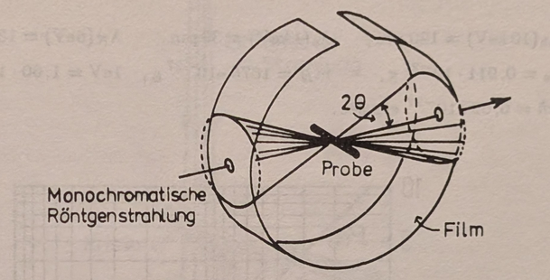
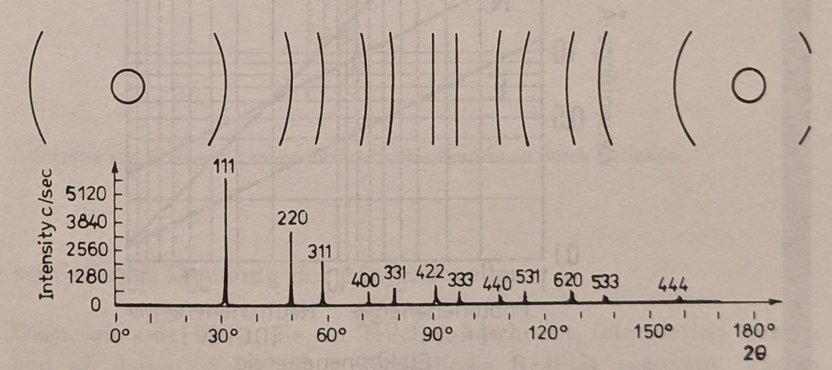
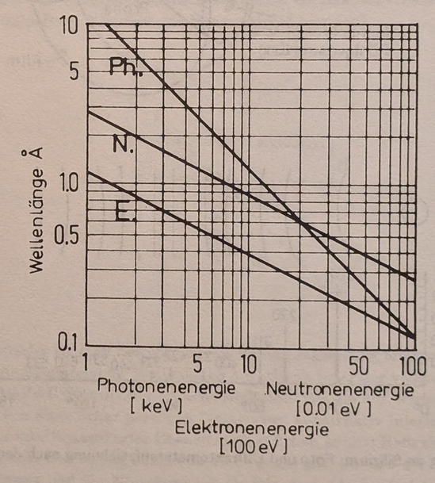
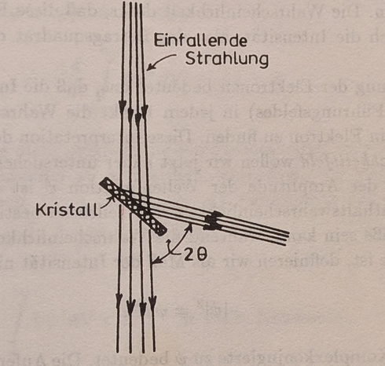
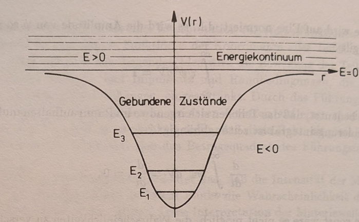

# Chapter 3 — The Wave Aspect of Matter
*(Der Wellenaspekt der Materie)*

> Source: Walter Greiner, *Quantum Mechanics: An Introduction*, Chapter 3.
> Screenshots: [`source/p37.jpg`](source/) – [`source/p66.jpg`](source/).

**Theme of the chapter.** Chapter 2 ended with light forced to be *both* wave and
particle, the balance set by how many photons occupy a mode. De Broglie's leap
was to run the duality **backwards**: if light — long thought a pure wave — also
behaves as particles, then matter — long thought pure particles — should also
behave as a wave. This section postulates that **every** free particle of energy
$E$ and momentum $\vec p$ has a wave of frequency $\nu = E/h$ and wavevector
$\vec k = \vec p/\hbar$ attached to it, builds the plane wave and the wave packet
that represent it, and shows two things that look paradoxical but are not: the
matter wave's **phase velocity exceeds $c$**, yet its **group velocity equals the
particle's ordinary velocity**. The experiments (Davisson–Germer, Thomson,
Debye–Scherrer) turn the hypothesis into fact by diffracting electrons off
crystals. The chapter then asks what the wave *means* and answers with Born's
statistical interpretation: $|\psi|^2$ is a probability density. From that one
idea it develops, in quick succession, normalization, the plane-wave basis and
Hilbert space, mean values and the momentum operator $-i\hbar\vec\nabla$, the
operator dictionary ($\hat T$, $\hat{\vec L}$, $\hat H$), the superposition
principle, and a first pass at the Heisenberg uncertainty relation — the
complete toolkit that the Schrödinger equation (the wave equation these de
Broglie waves must obey) will put to work.

---

## 3.1 The de Broglie relations and the matter wave
*(Die de Broglieschen Wellen)*

<!-- source: source/p37.jpg, source/p38.jpg -->

### The hypothesis

For a photon the wave picture (frequency $\nu$, wavevector $\vec k$) and the
particle picture (energy $E$, momentum $\vec p$) are tied together by

$$
E = h\nu = \hbar\omega \qquad (1)
$$

$$
\vec p = \hbar\vec k = \frac{h}{\lambda}\frac{\vec k}{|\vec k|} \qquad (2)
$$

These are known to be correct for the electromagnetic field. **De Broglie
postulated that they hold for *all* particles** — an electron of mass $m$ drifting
freely at velocity $\vec v$ included. "What is right for the photon should be right
for every particle." Here $\omega = 2\pi\nu$ is the angular frequency, $\hbar =
h/2\pi$, and $\lambda$ the wavelength; Eq. (2) just says the momentum points along
$\vec k$ with magnitude $p = h/\lambda$.

Granting (1) and (2), each free particle is assigned — up to an amplitude $A$ — a
**plane wave**:

$$
\psi(\vec r,t) = A e^{i(\vec k\cdot\vec r - \omega t)} \qquad (3)
$$

Using (1) and (2) to trade the wave quantities for the mechanical ones
($\vec k = \vec p/\hbar$, $\omega = E/\hbar$) rewrites the exponent in terms of
$\vec p$ and $E$:

$$
\psi(\vec r,t) = A e^{(i/\hbar)(\vec p\cdot\vec r - E t)} \qquad (3a)
$$

This $\psi$ is the object the rest of quantum mechanics is built on. For now it is
only a postulate; its meaning (a probability amplitude) and its equation of motion
(Schrödinger's) come later.

### The de Broglie wavelength

From (2) with $p = mv$ the assigned wavelength is

$$
\lambda = \frac{h}{p} = \frac{h}{mv} \qquad (4)
$$

the second form holding only for particles with non-zero rest mass. Because
$h$ is so tiny ($\approx 6.6\times 10^{-34}\ \text{J s}$), $\lambda$ is measurable
only when $mv$ is small enough — which is why the wave character of matter shows up
only at the **atomic scale** and never for everyday objects. (A thrown baseball
has $\lambda \sim 10^{-34}\ \text{m}$, utterly unobservable; a slow electron has
$\lambda \sim 1\ \text{Å}$, the size of an atom.)

### Phase of the wave and the phase velocity

Write the phase of (3) as

$$
\alpha = \omega t - \vec k\cdot\vec r
$$

(so the exponent is $-i\alpha$). A surface of constant phase is what we watch when
we ask how fast the wave "moves." Holding $\alpha$ fixed and differentiating along
the motion,

$$
\frac{d\alpha}{dt} = \omega - \vec k\cdot\dot{\vec r} = \omega - \vec k\cdot\vec u = 0
$$

where $\vec u = \dot{\vec r}$ is the velocity of the constant-phase surface. Since
$\vec k$ and $\vec u$ point the same way, the magnitude of the **phase velocity** is

$$
|\vec u| = \frac{\omega}{k} \qquad (\ast)
$$

**Symbols recap.** $\alpha$ — phase; $\vec u$ — phase velocity (speed of a
constant-phase surface); $k = |\vec k| = 2\pi/\lambda$ — wavenumber.

---

## 3.2 Matter waves disperse even in vacuum
*(Dispersion im Vakuum)*

<!-- source: source/p38.jpg, source/p39.jpg -->

To evaluate $u = \omega/k$ we need $\omega$ as a function of $k$ — the **dispersion
relation**. This is where matter waves part company with light. Start from the
relativistic energy–momentum relation for a free particle,

$$
E^2 = m_0^2 c^4 + p^2 c^2
$$

with $m_0$ the rest mass. For $v \ll c$ expand the square root
($E = mc^2 = \sqrt{m_0^2c^4 + p^2c^2} = m_0 c^2\sqrt{1 + p^2/m_0^2c^2}$):

$$
E = \sqrt{m_0^2 c^4 + p^2 c^2} = m_0 c^2 + \frac{p^2}{2m_0} + \cdots
$$

— the rest energy plus the familiar Newtonian kinetic energy $p^2/2m_0$. Dividing
by $\hbar$ and putting $p = \hbar k$ gives $\omega(k) = E/\hbar$ as a function of
the wavenumber:

$$
\omega(k) = \frac{m_0 c^2}{\hbar} + \frac{\hbar k^2}{2m_0} + \cdots \qquad (5)
$$

The decisive point: **$\omega$ depends on $k$ non-linearly** (the $k^2$ term). For
electromagnetic waves in vacuum $\omega = ck$ is exactly linear, so all
wavelengths travel at the same speed and there is *no* dispersion. The de Broglie
wave already disperses **in empty space** — waves of different wavelength move at
different phase velocities:

$$
u = \frac{\omega}{k} = \frac{m_0 c^2}{\hbar k} + \frac{\hbar k}{2m_0} + \cdots
$$

### Phase velocity exceeds $c$ — and why that is harmless

There is a cleaner exact form. Using (1) and (2) directly,

$$
u = \frac{\omega}{k} = \frac{\hbar\omega}{\hbar k} = \frac{E}{p} = \frac{mc^2}{mv} = \frac{c^2}{v}
$$

Since the particle is massive it moves slower than light, $v < c$, so

$$
u = \frac{c^2}{v} > c
$$

The phase velocity of a matter wave is **always greater than the vacuum speed of
light**. This cannot be the speed of the particle (which is massive and subluminal),
and it does *not* violate relativity: a single infinite plane wave of one fixed
frequency carries no signal and transports no energy — it is the same everywhere
for all time, so "how fast its crests move" is not the speed of anything physical.
Information and energy travel at the **group** velocity, computed next, which we
will find equals $v < c$.

---

## 3.3 Group velocity equals the particle velocity
*(Die Gruppengeschwindigkeit)*

<!-- source: source/p39.jpg -->

The **group velocity** — the speed at which a localized disturbance (a packet of
nearby wavenumbers) travels — is

$$
v_g = \frac{d\omega}{dk} = \frac{d(\hbar\omega)}{d(\hbar k)} = \frac{dE}{dp}
$$

the last step just multiplying top and bottom by $\hbar$ via (1) and (2). So
$v_g = dE/dp$, and we can get this without re-differentiating (5) by a short
mechanical argument.

**A force argument for $dE/dp = v$.** Push the particle with a force $\vec F$
through a displacement $d\vec s$. The work–energy theorem gives the energy change
$dE = \vec F\cdot d\vec s$, and Newton's law gives $\vec F = d\vec p/dt$. Hence

$$
dE = \frac{d\vec p}{dt}\cdot d\vec s = d\vec p\cdot\vec v
$$

since $d\vec s/dt = \vec v$. Because $\vec v$ and $\vec p$ are parallel,
$d\vec p\cdot\vec v = v dp$, so

$$
\frac{dE}{dp} = v \qquad\Longrightarrow\qquad \boxed{v_g = v}
$$

**The group velocity of the matter wave is the ordinary velocity of the particle.**
(The same falls straight out of differentiating $E = \sqrt{m_0^2c^4 + p^2c^2}$:
$dE/dp = pc^2/E = mvc^2/mc^2 = v$.) This is the resolution promised above — the
*phase* velocity $c^2/v$ is superluminal and unphysical as a transport speed, but
the *group* velocity, which is what actually carries the particle's energy and
"whereabouts," is exactly $v$.

> **Why this matters.** Two velocities, two jobs. The phase velocity tracks the
> crests of an idealized infinite wave and may exceed $c$; the group velocity
> tracks the *envelope* — the lump of probability that is the particle — and obeys
> $v_g = v < c$. Keeping them distinct is what makes the wave picture compatible
> with a localized, subluminal particle.

---

## 3.4 The wave packet
*(Das Wellenpaket)*

<!-- source: source/p40.jpg, source/p41.jpg, source/p42.jpg -->

### Why a single plane wave cannot localize a particle

It is tempting to object that the plane wave (3) *does* move — its crests travel
at the phase velocity — so why can it not represent a moving particle? The catch
is that **propagation of the wave is not the same as a localized lump being
somewhere and moving.** The quantity that says *where* the particle is likely to
be found is not $\psi$ itself but the **probability density** $|\psi|^2$ (the Born
rule, formalized later); "here and not there" means $|\psi|^2$ is peaked at one
place and small elsewhere. For the plane wave the exponentials cancel exactly:

$$
|\psi(\vec r,t)|^2 = \psi^\ast\psi = A^\ast e^{-i(\vec k\cdot\vec r - \omega t)} A e^{i(\vec k\cdot\vec r - \omega t)} = |A|^2
$$

so $|\psi|^2 = |A|^2$ is **constant over all space and all time** — the particle is
equally likely to be found *anywhere*. That is maximal *de*localization, the
opposite of "here and not there."

The crests do slide along, but they are identical everywhere, so nothing on the
infinite wave marks a location; meanwhile the one quantity that could mark a
location, $|\psi|^2$, is flat and does not move at all. (Picture an endless,
perfectly uniform ocean swell: the crests travel, yet there is no *pulse* sitting
at any particular spot. A single splash, by contrast, makes a localized ripple
*packet* that is somewhere and moves.)

The deeper reason is complementarity: a single plane wave has one sharp
wavenumber $\vec k$, hence — via $\vec p = \hbar\vec k$ — one **exactly defined
momentum**, and a perfectly sharp momentum forces a completely indefinite
position (the uncertainty principle, Chapter 4). To localize the particle we must
give up sharp momentum and superpose a *band* of wavenumbers, so that the
exponentials no longer cancel and interference can build a bump.

### Building the packet

So to localize the particle we superpose a narrow band of wavenumbers around a
central $k_0$ — a **wave packet**. Taking a group running along $x$:

$$
\psi(x,t) = \int_{k_0-\Delta k}^{k_0+\Delta k} c(k) e^{i(kx - \omega(k)t)} dk \qquad (6)
$$

Here $k_0 = 2\pi/\lambda_0$ is the mean wavenumber and $\Delta k$ measures the
packet's spread in wavenumber, assumed small ($\Delta k \ll k_0$). Because the band
is narrow we may **Taylor-expand** $\omega(k)$ about $k_0$ and drop terms of order
$(k-k_0)^2$ and higher:

$$
\omega(k) = \omega(k_0) + \left(\frac{d\omega}{dk}\right)_{k_0}(k-k_0) + \frac{1}{2}\left(\frac{d^2\omega}{dk^2}\right)_{k_0}(k-k_0)^2 + \cdots \qquad (7)
$$

Introduce $\xi = k - k_0$ as the integration variable and identify the
first-derivative coefficient as the group velocity,
$(d\omega/dk)_{k_0} \equiv v_g$. To first order $\omega(k) = \omega(k_0) + v_g\xi$,
and the exponent splits cleanly:

$$
kx - \omega(k)t = \big[k_0 x - \omega(k_0)t\big] + \xi\big(x - v_g t\big)
$$

so

$$
\psi(x,t) = e^{i(k_0 x - \omega(k_0)t)} \int_{-\Delta k}^{\Delta k} e^{i(x - v_g t)\xi} c(k_0+\xi) d\xi \qquad (6a)
$$

### Doing the integral

Treat the amplitude as slowly varying across the narrow band, $c(k_0+\xi)\approx
c(k_0)$, and pull it out. The remaining integral is elementary:

$$
\int_{-\Delta k}^{\Delta k} e^{i(x-v_g t)\xi} d\xi = \frac{e^{i(x-v_g t)\Delta k} - e^{-i(x-v_g t)\Delta k}}{i(x-v_g t)} = \frac{2\sin\big(\Delta k (x-v_g t)\big)}{x - v_g t}
$$

Therefore

$$
\psi(x,t) = C(x,t) e^{i(k_0 x - \omega(k_0)t)} \qquad (8)
$$

$$
C(x,t) = 2 c(k_0)\frac{\sin\big(\Delta k (x - v_g t)\big)}{x - v_g t} \qquad (8')
$$

The packet is a **carrier wave** $e^{i(k_0 x - \omega(k_0)t)}$, oscillating fast at
the mean wavenumber/frequency, multiplied by a slowly varying **envelope**
$C(x,t)$.

### Reading the envelope: a $\sin z / z$ shape

Put $z = \Delta k (x - v_g t)$, so $C \propto \sin z / z$. This function

$$
\lim_{z\to 0}\frac{\sin z}{z} = 1 \quad (z=0), \qquad \frac{\sin z}{z} = 0 \quad (z = \pm\pi),
$$

has a tall central peak at $z = 0$ and only small, fast-decaying side lobes. So the
superposition is **localized**: $|\psi|$ is appreciable only in a finite region —
the particle — and falls off like $\sin z/z$ away from the center.

<!-- figure: cropped from source/p41.jpg -->
Several fast-oscillating waves of slightly different wavenumber superpose into one
spatially bounded group. The rapid wiggle is the carrier at $k_0$; the dashed
bell is the envelope $C(x,t) \propto \sin z/z$ with $z = \Delta k(x - v_g t)$.

### The packet moves at $v_g$

The central maximum sits where $z = 0$, i.e.

$$
x - v_g t = 0 \qquad\Longrightarrow\qquad \frac{dx}{dt} = v_g
$$

so the surface of fixed amplitude — and the whole packet with it — travels at the
group velocity.

**A second route: the probability density is a rigid traveling profile.** The same
conclusion follows from tracking the probability density $|\psi|^2$ rather than the
peak. First, "demanding $|\psi|^2 = \text{const}$" does **not** mean the density is
uniform (contrast the plane wave at the start of the section); it means we pick the
value of $|\psi|^2$ at whatever feature of the bump we want to follow — the peak, a
half-maximum point, any contour — and track the locus where the density keeps that
value. Take the modulus squared of (8); the carrier has modulus one,
$|e^{i(k_0 x - \omega_0 t)}| = 1$, so it drops out and only the envelope survives:

$$
|\psi(x,t)|^2 = |C(x,t)|^2 = 4 |c(k_0)|^2 \frac{\sin^2\big(\Delta k (x - v_g t)\big)}{(x - v_g t)^2} = F(x - v_g t)
$$

The density depends on $x$ and $t$ **only through the combination** $s = x - v_g t$
— the signature of a fixed shape sliding along at speed $v_g$ without deforming.
Holding the density at a feature's value pins that combination, and differentiating
gives the speed:

$$
F(s) = \text{const} \quad\Longrightarrow\quad s = x - v_g t = \text{const} \quad\Longrightarrow\quad \frac{dx}{dt} = v_g
$$

Because this holds for *every* contour value, the whole packet translates together
at $v_g$. Two things are worth noticing. The fast carrier underneath travels at the
phase velocity $c^2/v > c$, but with modulus one it cancels out of $|\psi|^2$
entirely — the physical density cannot see it, which is exactly why the particle
moves at the group velocity and not the (superluminal) phase velocity. And the
clean result relied on dropping the second-order phase term: keep
$\tfrac{1}{2}\omega''\xi^2 t$ and $|\psi|^2$ would depend on $x$ and $t$ separately,
the profile would change shape as it moves (spreading), and no single rigid speed
would exist — consistent with the caveat below.

Either way, differentiating the dispersion relation (5) pins the value down
nonrelativistically:

$$
v_g = \left(\frac{d\omega}{dk}\right)_{k_0} = \left(\frac{\hbar k}{m_0}\right)_{k_0} = \frac{\hbar k_0}{m_0} = \frac{p}{m_0} = v
$$

consistent with §3.3.

### A caveat: the packet spreads

The clean result $v_g = v$ used only the **first-order** term in (7). But matter
waves disperse in vacuum, so the second derivative does **not** vanish:

$$
\frac{d^2\omega}{dk^2} = \frac{\hbar}{m_0} \neq 0
$$

Each monochromatic component travels at a slightly different speed, so the packet
does not keep its shape — it gradually **spreads** (*zerfließt*). Only while the
dispersion term is negligibly small ($d^2\omega/dk^2 \approx 0$) may we treat the
packet as a rigid lump moving as a whole at $v_g$. Over longer times the
spreading must be accounted for — a genuinely quantum feature we return to when
solving the Schrödinger equation.

---

## 3.5 The de Broglie wavelength: formulas and numbers
*(Wellenlänge und Auflösungsvermögen)*

<!-- source: source/p42.jpg, source/p43.jpg -->

From $k = 2\pi/\lambda$ and $p = \hbar k$ the assigned wavelength is

$$
\lambda = \frac{2\pi}{k} = \frac{2\pi\hbar}{p} = \frac{h}{p}
$$

For a non-relativistic particle ($v \ll c$) the kinetic energy is $E = p^2/2m_0$,
so $p = \sqrt{2m_0 E}$ and

$$
\boxed{\lambda = \frac{h}{\sqrt{2m_0 E}}} \qquad (9)
$$

To get the wavelength of a moving particle you need its **rest mass and kinetic
energy**.

**Worked number — a 10 keV electron.** With $m_0 = 9.1\times 10^{-28}\ \text{g}$
and $E = 10\ \text{keV}$, Eq. (9) gives

$$
\lambda_e \approx 0.122\ \text{Å}
$$

(Check: $\lambda = h/\sqrt{2m_0E}$ with $h = 6.6\times 10^{-34}\ \text{J s}$,
$m_0 = 9.1\times 10^{-31}\ \text{kg}$, $E = 1.6\times 10^{-15}\ \text{J}$ gives
$1.2\times 10^{-11}\ \text{m}$.) This is far shorter than visible light and
comparable to atomic spacings — already a hint that electrons can probe matter at
the atomic scale.

### Why short wavelengths mean sharp microscopes

A microscope's **resolving power** is limited by the wavelength of whatever
"illuminates" the object: the smaller $\lambda$, the smaller the separation of two
points that can still be told apart (cf. Example 3.7). Visible light has
$\lambda_L \approx 5000\ \text{Å}$, which limits an optical microscope to about
$2000\times$ magnification.

- **Electron microscope.** Replacing light by electrons (whose $\lambda$ is
  hundreds of times shorter, as just computed) reaches up to $\sim 500{,}000\times$
  magnification and a resolution of about $5$–$10\ \text{Å}$.
- **High-energy probes.** Protons and mesons at GeV energies ($10^9\ \text{eV}$)
  have wavelengths of $10^{-14}$–$10^{-15}\ \text{cm}$, short enough to resolve the
  **internal structure of elementary particles** themselves.

> **The unifying idea.** "Seeing small" is "diffracting short waves." Whether the
> wave is light or an electron beam or a GeV proton, the resolution is set by
> $\lambda = h/p$ — so to look deeper you raise the momentum. This single
> relation links optical microscopes, electron microscopes, and particle
> accelerators on one scale.

---

## 3.6 Diffraction of matter beams
*(Beugung von Materiestrahlen)*

<!-- source: source/p43.jpg, source/p44.jpg, source/p45.jpg -->

Interference and diffraction are unambiguous signatures of **waves** — in
particular, destructive interference has no corpuscular explanation. Just as the
photoeffect and Compton effect (Chapter 1) revealed the *particle* nature of
light, **diffraction of electron beams** is the direct evidence for matter waves.

Electron wavelengths (fractions of an Å) are far too short for a ruled artificial
grating, so one uses the regular spacing of a **crystal lattice** as the grating.
The experiments essentially repeat, with electron beams, the structure analyses
done earlier with X-rays.

### Davisson–Germer: a crystal surface as a plane grating

Davisson and Germer applied the **Laue method**: the surface of a single crystal
acts as a *plane* diffraction grating. The electrons are diffracted at the surface
and do not penetrate the crystal. Diffraction maxima appear under the
plane-grating condition

$$
n\lambda = d\sin\theta
$$

with $d$ the spacing of surface rows, $\theta$ the diffraction angle, and $n$ an
integer.

<!-- figure: cropped from source/p44.jpg -->
Electrons strike the crystal surface and are diffracted; the path difference
between adjacent scattering centers a distance $d$ apart is $d\sin\theta$, so
constructive interference (a maximum) occurs when this equals a whole number of
wavelengths, $n\lambda = d\sin\theta$.

If the electron is accelerated through a voltage $U$, its kinetic energy is
$E = eU$, and inserting Eq. (9) gives $\lambda = h/\sqrt{2m_0 eU}$, which turns the
condition into a relation between voltage and angle:

$$
n\frac{h}{d\sqrt{2m_0 e}} = \sqrt{U}\sin\theta
$$

confirmed by the measurements.

### Thomson and the Debye–Scherrer powder method

Tartakowski and G. P. Thomson instead used the **Debye–Scherrer** technique:
monochromatic radiation is scattered from a body of **pressed crystal powder**.
The powder is a three-dimensional grating of randomly oriented crystallites, so —
whatever the beam direction — *some* crystallites are always oriented to satisfy
the reflection condition. Here the relevant condition is **Bragg reflection** from
lattice planes a distance $d$ apart,

$$
2d\sin\theta = n\lambda \qquad (\text{Wulf--Bragg})
$$

<!-- figure: cropped from source/p45.jpg -->
A matter wave Bragg-reflects off a favorably oriented crystallite (upper sketch,
spacing $d$, glancing angle $\theta$). Because crystallites take all orientations,
the apparatus is symmetric about the beam axis $\overline{SO}$, so the pattern on a
screen a distance $L$ away is a set of concentric rings of radius $D/2$ at
deflection $2\theta$.

**The ring geometry.** By the radial symmetry the screen pattern is rings about the
forward point $O$, with

$$
\tan(2\theta) = \frac{D}{2L}
$$

where $L$ is the screen distance and $D$ the ring diameter. The angles are kept so
small that $\tan(2\theta) \approx 2\theta$ and $\sin\theta\approx\theta$. Combining
the small-angle form $2\theta \approx D/2L$ (so $\theta \approx D/4L$) with the
Bragg condition $2d\theta = n\lambda$:

$$
2d\cdot\frac{D}{4L} = n\lambda \qquad\Longrightarrow\qquad \boxed{Dd = 2nL\lambda}
$$

Finally, for electrons accelerated through $U$, substituting
$\lambda = h/\sqrt{2m_0 eU}$:

$$
D\sqrt{U} = \frac{2nLh}{d\sqrt{2m_0 e}}
$$

The experimental results agreed completely. Today electron beams — and even more
so **neutron beams** — are an essential tool of solid-state physics for
determining crystal structures.

> **Two conditions, one idea.** The surface (Davisson–Germer) experiment uses the
> plane-grating law $n\lambda = d\sin\theta$; the powder (Debye–Scherrer)
> experiment uses Bragg reflection $2d\sin\theta = n\lambda$ from stacks of
> lattice planes (the factor $2$ is the extra path down to and back from the
> second plane). Both are the *same* statement — constructive interference when
> the path difference is a whole number of de Broglie wavelengths — applied to a
> 2D row of scatterers versus a 3D stack of planes.

---

## 3.7 Exercise 3.1 — diffraction patterns of monochromatic X-rays
*(Beugungsbilder monochromatischer Röntgenstrahlung)*

<!-- source: source/p46.jpg -->

**(a) An ideal single crystal in a monochromatic beam.** An ideal crystal is a
perfectly regular array of atoms; incoming radiation of wavelength $\lambda$ is
weakly reflected by each family of lattice planes, but a macroscopic reflection
appears only when the reflections from one family of parallel planes interfere
constructively — the **Bragg condition** $2d\sin\vartheta = n\lambda$ (with $n$
integer, $\vartheta$ the angle between beam and net plane).

<!-- figure: cropped from source/p46.jpg -->
The same crystal lattice can be sliced into many different families of parallel
net planes — two are shown, with spacings $d$ and $d'$. Each family has its own
spacing and its own orientation, hence its own fixed Bragg angle, which is why a
single monochromatic beam usually satisfies none of them.

The catch: for an *ideal, fixed* crystal the orientation already fixes $\vartheta$
for each plane family, and $d$ and $\lambda$ are fixed too. With $d$, $\vartheta$,
and $\lambda$ all determined, there is in general **no integer $n$** that satisfies
$2d\sin\vartheta = n\lambda$ — so usually **no reflection occurs at all**. To get a
pattern one must relax one of the fixed quantities:

- **Laue method** — illuminate with a *continuous* (white) spectrum instead of
  monochromatic light; then for each plane family some wavelength satisfies Bragg,
  and the pattern is a set of regular, discrete **spots**.
- **Rotating-crystal method** — vary $\vartheta$ by turning the crystal, sweeping
  different planes through the Bragg condition in turn.

**(b) Debye–Scherrer powder.** With a powder rather than a single crystal, the
crystallites take *all* orientations, so for any wavelength some grains always
satisfy Bragg. Each plane family then reflects into a **cone** about the beam, and
the pattern on the screen is a set of concentric **rings** (as in §3.6) rather than
isolated spots.

> **Why a powder rescues a monochromatic beam.** A single fixed crystal gives you
> one orientation and almost certainly misses the Bragg condition. A powder is, in
> effect, a single crystal "averaged over all rotations at once" — it offers every
> $\vartheta$ simultaneously, so a fixed $\lambda$ always finds matching grains.
> This is exactly why powder diffraction is the workhorse method for materials
> with no large single crystals available.

---

## 3.8 Exercise 3.2 — diffraction of electrons and neutrons
*(Beugung von Elektronen und Neutronen)*

<!-- source: source/p47.jpg, source/p48.jpg, source/p49.jpg -->

### Closing out Exercise 3.1(b): why the powder gives cones

Page 47 finishes the powder argument of §3.7(b). With monochromatic radiation
falling on a powder, *most* crystallites reflect nothing (the fixed-crystal
problem of part (a) applies to each grain individually). Only those grains
whose net planes happen to lie at one of the reflection-capable angles
$\vartheta$ interfere constructively, and each such grain deflects the beam by
$2\vartheta$. Because the grains are distributed uniformly in azimuth around
the beam axis, these deflected rays fill out a complete **cone of reflection**
of opening angle $2\vartheta$ — one cone per Bragg-active plane family.

<!-- figure: cropped from source/p47.jpg -->
Geometry of a powder (Debye–Scherrer) camera. Monochromatic X-rays enter
through a hole, strike the sample ("Probe"), and each Bragg-active family of
net planes throws a cone of deflection angle $2\theta$ onto the surrounding
film.

<!-- figure: cropped from source/p47.jpg -->
Diffraction by silicon: the film (top) shows the ring segments, and the
diffractometer trace (bottom) plots intensity in counts per second against the
deflection $2\theta$. Each peak is labeled by the Miller indices of the plane
family that produced it — 111, 220, 311, ... — with the largest plane spacings
(lowest indices) at the smallest angles, exactly as $2d\sin\theta = n\lambda$
demands.

### The exercise

Compute the wavelengths of the probability waves of $10\ \text{keV}$ X-rays,
$1\ \text{keV}$ electrons, and $5\ \text{eV}$ neutrons. Does the diffraction
pattern of Exercise 3.1 change if the X-rays are replaced by neutrons of the
*same wavelength*? Bonus question: how does one produce "monochromatic"
neutrons?

### (a) The three wavelengths

One formula covers all three probes if we start relativistically. The
wavelength is $\lambda = 2\pi/k$, the de Broglie relation gives
$k = p/\hbar$, and the momentum follows from the total energy $E$ via the
energy–momentum relation $E^2 = p^2c^2 + m_0^2c^4$, i.e.
$p = \sqrt{(E/c)^2 - m_0^2c^2}$. Chaining these together:

$$
\lambda = \frac{2\pi\hbar}{p} = 2\pi\hbar\left[(E/c)^2 - m_0^2 c^2\right]^{-1/2}
$$

Two limits matter here:

- **Photons** have $m_0 = 0$, so $p = E/c$ exactly and

$$
\lambda_{\mathrm{ph}} = \frac{2\pi\hbar c}{E_{\mathrm{ph}}}
$$

- **Electrons and neutrons** at these low energies are non-relativistic
  ($1\ \text{keV} \ll m_ec^2 = 511\ \text{keV}$, and even more so for the
  neutron), so $p = \sqrt{2m_0 E_{\mathrm{kin}}}$ and

$$
\lambda = \frac{2\pi\hbar}{\sqrt{2m_0 E_{\mathrm{kin}}}}
$$

which is just Eq. (9) again. Plugging in ($m_e = 0.911\times 10^{-27}\ \text{g}$,
$m_N = 1675\times 10^{-27}\ \text{g}$, $1\ \text{eV} = 1.60\times 10^{-12}\ \text{erg}$,
$2\pi\hbar = h = 6.62\times 10^{-27}\ \text{erg s}$):

$$
\lambda_{\mathrm{ph}}(10\ \text{keV}) \approx 120\ \text{pm}, \qquad \lambda_e(1\ \text{keV}) \approx 39\ \text{pm}, \qquad \lambda_N(5\ \text{eV}) \approx 13\ \text{pm}
$$

(Quick check on the photon: $\lambda = hc/E = 1240\ \text{eV nm}/10^4\ \text{eV}
\approx 0.124\ \text{nm}$.) All three are of the order of an ångström or below
— all three probes "see" crystal lattices.

> **Why such wildly different energies give similar wavelengths.** For a
> massive particle $\lambda \propto 1/\sqrt{m_0 E}$. The neutron is $\sim 1836$
> times heavier than the electron, so it reaches the same wavelength with
> $\sim 1836$ times less kinetic energy — that is why thermal-ish neutrons
> (eV scale) and keV electrons and keV photons all land in the same
> diffraction-friendly ångström window.

<!-- figure: cropped from source/p48.jpg -->
Wavelength as a function of particle energy for photons (Ph., energy scale in
keV), neutrons (N., scale in units of 0.01 eV) and electrons (E., scale in
units of 100 eV), on log-log axes. The photon line has slope $-1$ since
$\lambda \propto 1/E$; the two matter lines have slope $-1/2$ since
$\lambda \propto E^{-1/2}$.

### (b) Same wavelength, same angles — different intensities

If the X-rays are replaced by neutrons of equal wavelength, the **scattering
angles stay the same**: the Bragg condition $2d\sin\theta = n\lambda$ involves
only the wavelength and the lattice geometry, not the identity of the probe.
But the **relative intensities change**, because the two probes couple to
different things:

- X-rays scatter off the **electron distribution** of the atoms;
- neutrons scatter off the **atomic nuclei** (and off magnetic dipole moments
  where present).

So the ring *positions* are unchanged while the ring *brightnesses*
redistribute. This is a feature, not a bug: neutron diffraction sees light
atoms (hydrogen!) and magnetic order that X-rays are nearly blind to, which is
why the two methods complement each other in structure determination.

### (c) Making "monochromatic" neutrons

Use Bragg reflection itself as the filter. A **polychromatic** neutron beam
falls on a *monochromator crystal*. At a chosen exit angle $2\vartheta$ only
those wavelengths survive that satisfy $n\lambda = 2d\sin\vartheta$ — and in
practice one reflection ($n = 1$ with one particular plane spacing $d$) is far
stronger than the rest, so the reflected beam is essentially single-wavelength.

<!-- figure: cropped from source/p49.jpg -->
Producing monochromatic neutrons by Bragg reflection: the incident
polychromatic beam ("Einfallende Strahlung") passes the tilted crystal, and at
the angle $2\theta$ only wavelengths obeying $n\lambda = 2d\sin\theta$ emerge;
the $n = 1$ reflection dominates.

> **A pleasing circularity.** The same physics being *tested* (matter waves
> Bragg-reflect off crystals) is used as a *tool* to prepare the beam for the
> test. By 3.8(a)'s formula, selecting a wavelength is selecting a velocity,
> so a monochromator is simultaneously a velocity filter for neutrons.

---

## 3.9 The statistical interpretation of matter waves
*(Die statistische Deutung der Materiewellen)*

<!-- source: source/p49.jpg, source/p50.jpg, source/p51.jpg, source/p52.jpg -->

### What *is* the wave that describes a particle?

In the early years of quantum mechanics it was genuinely unclear how the wave
attached to a particle should be interpreted, and whether it possessed
physical reality. The experimental facts sharpen the question: a **single
electron always behaves like a particle** — it hits the detector at *one*
spot. The diffraction pattern emerges only after **very many** electrons have
been scattered. So the wave cannot be the electron smeared out in space; it
must govern the *statistics* of many identical trials.

**Max Born** pioneered the statistical interpretation of the wavefunction. His
picture: the **guiding field** (*Führungsfeld*), a scalar function $\psi$ of
the coordinates of all particles and of time. The particles themselves move
only subject to energy and momentum conservation and to the boundary
conditions imposed by the apparatus; *within* those limits, the guiding field
holds the particle on one of the admissible paths, and the **probability that
a given path is taken is given by the intensity** — the squared magnitude —
of the guiding field. (Born interpreted Schrödinger's wavefunction as a
probability amplitude in 1926; the belated Nobel Prize for it came in 1954.)

For electron diffraction this says concretely: the intensity of the matter
wave at each point gives the probability of finding an electron *there*. This
reading of the matter wave as a **probability field** is what the rest of the
section makes quantitative.

### Intensity must be $|\psi|^2$, not $\psi^2$

The square of the amplitude of $\psi$ is the intensity, and it is to determine
the probability of finding the particle. But $\psi$ may be **complex**, while
a probability is always real and non-negative. So the correct measure of
intensity is not $\psi^2$ but

$$
|\psi|^2 = \psi\psi^\ast \qquad (10)
$$

where $\psi^\ast$ is the complex conjugate of $\psi$. This is automatically
real and $\geq 0$, as a probability density must be.

The probability of finding the particle is, moreover, proportional to the size
of the volume element inspected. Let $dW(x,y,z,t)$ be the probability of
finding the particle in the volume element $dV = dx\ dy\ dz$ at time $t$.
The statistical interpretation is then the hypothesis

$$
dW(x,y,z,t) = |\psi(x,y,z,t)|^2 dV
$$

To get a quantity independent of the size of $dV$, define the (spatial)
**probability density**

$$
w(x,y,z,t) = \frac{dW}{dV} = |\psi(x,y,z,t)|^2 \qquad (11)
$$

This is the precise statement of what §3.4 used informally ("$|\psi|^2$ says
where the particle is likely to be").

### Normalization

The particle must be *somewhere* in space, so the probabilities must add up to
one. The amplitude of $\psi$ is therefore chosen so that

$$
\int_{-\infty}^{\infty} \psi\psi^\ast dV = 1 \qquad (12)
$$

Two remarks, both of which matter more than they look:

**The normalization integral is time-independent.**

$$
\frac{d}{dt}\int_{-\infty}^{\infty} \psi\psi^\ast dV = \frac{d}{dt} 1 = 0
$$

Without this, probabilities evaluated at different times could not be compared
with one another — "the particle is somewhere" would hold at one instant and
fail at the next. (That the dynamics actually *preserves* the norm is a
property of the Schrödinger equation, shown when we have it in hand — Chapter 6.)

**Only square-integrable functions can be normalized.** Rescaling $\psi$ can
enforce (12) only if the improper integral converges,

$$
\int_{-\infty}^{\infty} \psi\psi^\ast dV < M, \qquad M \ \text{a real constant}
$$

i.e. if $\psi$ is **square-integrable**. The probability interpretation (11)
is plausible, but it is a *hypothesis*, to be validated by the success of the
results built on it — and it will be.

### Bound states, free states, and the potential well

A state is called **bound** (*gebunden*) when the motion of the system is
confined; if unconfined, it is a **free state** (*freier Zustand*). The course
will establish the pattern:

- **bound states** — energy $E < 0$ — have square-integrable $\psi$
  (normalizable per (12));
- **free states** — $E > 0$ — have $|\psi|^2$ that is *not* integrable.

<!-- figure: cropped from source/p52.jpg -->
Bound and continuum states for a particle in a potential well $V(r)$. The
discrete levels $E_1, E_2, E_3$ lie in the well at $E < 0$ ("Gebundene
Zustände" — bound states); above $E = 0$ stretches the energy continuum
("Energiekontinuum") of unbound states.

The figure makes this plausible: bound states live *in* the potential well and
can spread essentially only within it — confined region, decaying tails,
finite $\int|\psi|^2$. Free states lie *above* the well and extend without
bound — think of the plane wave, whose $|\psi|^2 = \text{const}$ integrates to
infinity over all space.

### The phase is not physical

A normalized wavefunction is determined only **up to a phase factor of modulus
one**, i.e. up to a factor $e^{i\alpha}$ with arbitrary real $\alpha$: both
$\psi$ and $e^{i\alpha}\psi$ satisfy (12), because

$$
(e^{i\alpha}\psi)(e^{i\alpha}\psi)^\ast = e^{i\alpha}e^{-i\alpha}\psi\psi^\ast = \psi\psi^\ast
$$

This non-uniqueness exists precisely because only the quantity
$\psi\psi^\ast = |\psi|^2$ carries physical meaning as a probability density —
nothing observable can depend on the overall phase. (*Relative* phases between
superposed states are a different story: they produce interference and are
very much observable, as §3.15 will show.)

---

## 3.10 Box normalization: taming the plane wave
*(Box-Normierung)*

<!-- source: source/p52.jpg, source/p53.jpg, source/p54.jpg -->

### The plane wave fails the normalization test

The prime example of a wavefunction that *cannot* be normalized by rule (12)
is our free-particle plane wave

$$
\psi(\vec r, t) = N e^{i(\vec k\cdot\vec r - \omega t)} \qquad (13)
$$

with $N$ a real constant. It describes a free particle with **sharp momentum**
$\vec p = \hbar\vec k$ and completely **indeterminate position** — so
$|\psi|^2 = N^2$ everywhere, and $\int|\psi|^2 dV$ over infinite space
diverges no matter how small $N$ is. (This is the same pathology as in §3.4,
now seen as a normalization failure.)

The fix: stop pretending space is infinite. Define all functions inside a
large but finite cube of edge length $L$ (volume $V = L^3$) — the **box
normalization**:

$$
\psi = N e^{i(\vec k\cdot\vec r - \omega t)} \ \ \text{for } \vec r \ \text{inside } V = L^3, \qquad \psi = 0 \ \ \text{outside} \qquad (14)
$$

(Greiner's footnote: an alternative normalization of such "continuum
wavefunctions" — the delta-function normalization — appears in Chapter 5; we
meet it early in Example 3.4 below.)

### Periodic boundary conditions

On the surface of the box the wavefunctions must satisfy some boundary
condition. Here is the liberating observation: for microphysics $L$ is
enormous ($L \gg 10^{-8}\ \text{cm}$, the atomic scale), so the boundary's
influence on the physics inside is negligible — which means we may choose the
boundary conditions **for convenience**. The most convenient choice is
**periodicity with period $L$**:

$$
\psi(x,y,z) = \psi(x+L,y,z) = \psi(x,y+L,z) = \psi(x,y,z+L) \qquad (15)
$$

> **Why periodic rather than, say, hard walls?** Periodic boundary conditions
> leave the plane waves $e^{i\vec k\cdot\vec r}$ themselves as the allowed
> functions (hard walls would force standing waves, i.e. sines, which are not
> momentum eigenfunctions). Since the whole point is to keep sharp-momentum
> states while gaining normalizability, periodicity is the natural choice —
> and any physical answer must become independent of the choice as
> $L \to \infty$.

### Fixing $N$

With the box in place the normalization integral is finite:

$$
1 = \int_{-\infty}^{\infty}\psi\psi^\ast dV = \int_{V=L^3}\psi\psi^\ast dV = N^2 \int_{V=L^3} dV = N^2 L^3
$$

(the exponential has modulus one, so $\psi\psi^\ast = N^2$). Hence

$$
N = \frac{1}{\sqrt{L^3}} = \frac{1}{\sqrt{V}}
$$

and the normalized plane wave reads

$$
\psi_{\vec k} = \frac{1}{\sqrt{V}} e^{i\vec k\cdot\vec r - i\omega(k)t} = \psi_{\vec k}(\vec r) e^{-i\omega(k)t} \qquad (16)
$$

The subscript $\vec k$ labels the wavefunction by its wavevector; the last
form splits off the time factor from the spatial part
$\psi_{\vec k}(\vec r) = e^{i\vec k\cdot\vec r}/\sqrt{V}$.

### The boundary conditions quantize the momentum

Periodicity (15) restricts the allowed wavevectors. Demanding
$e^{ik_x x} = e^{ik_x(x+L)}$ forces $e^{ik_x L} = 1$, i.e. $k_x L$ must be an
integer multiple of $2\pi$ — and likewise for $y$ and $z$. So

$$
\vec k = \frac{2\pi}{L}\vec n, \qquad \vec k = \{k_x,k_y,k_z\}, \qquad \vec n = \{n_x,n_y,n_z\}
$$

or in components

$$
k_x = \frac{2\pi}{L}n_x, \qquad k_y = \frac{2\pi}{L}n_y, \qquad k_z = \frac{2\pi}{L}n_z \qquad (17)
$$

where $n_x, n_y, n_z$ run over **all integers** (positive, negative, zero).
The momentum

$$
\vec p = \hbar\vec k = \frac{2\pi\hbar}{L}\vec n
$$

is thereby **quantized** — it runs over a discrete cubic lattice of spacing
$2\pi\hbar/L$ in momentum space. The same holds for the energy
$E = \hbar\omega(\vec k)$ and hence the frequency:

$$
\omega(\vec k) = \frac{E}{\hbar} = \frac{\vec p^2}{2\hbar m} = \frac{(\hbar k)^2}{2\hbar m} = \left(\frac{2\pi}{L}\right)^2 \frac{\hbar}{2m}\left(n_x^2 + n_y^2 + n_z^2\right) \qquad (17a)
$$

(non-relativistic dispersion, dropping the constant rest-energy term of
Eq. (5) — only energy *differences* matter here). Inserting the allowed
$\vec k$ into (16):

$$
\psi_{\vec k} = \frac{1}{\sqrt{V}} e^{i\left(\frac{2\pi}{L}\vec n\cdot\vec r - \omega(\vec n)t\right)} = \psi_{\vec k}(\vec r) e^{-i\omega(n)t} \qquad (18)
$$

Substituting these back confirms that the periodicity conditions (15) hold.

> **The box is scaffolding, not physics.** In the limit $L \to \infty$ the
> spacing $2\pi\hbar/L$ between adjacent momentum values goes to zero, the
> lattice of allowed $\vec k$ densifies into a continuum, and we recover the
> free particle in infinite space. The box exists so that intermediate steps
> (sums, normalizations, orthonormality) are finite and honest; every physical
> result must survive $L \to \infty$ — and Eq. (29) below, for example, does.

### The $\psi_{\vec k}$ form an orthonormal system

The normalized plane waves satisfy

$$
\int_V \psi_{\vec k}^\ast(\vec r)\psi_{\vec k'}(\vec r) dV = \delta_{\vec k\vec k'} \qquad (19)
$$

where $\delta_{\vec k\vec k'}$ is the Kronecker delta: $1$ if $\vec k = \vec k'$,
else $0$. (Only the spatial parts are used here — the time factors
$e^{-i\omega t}$ have modulus one and, for $\vec k = \vec k'$, cancel exactly,
so they change nothing in (19).)

**Proof.** The 3D integral factorizes into three identical 1D integrals:

$$
\int_{V=L^3}\psi_{\vec k}^\ast\psi_{\vec k'} dV = \frac{1}{L^3} \int_{-L/2}^{L/2} e^{i(k_x'-k_x)x}dx \int_{-L/2}^{L/2} e^{i(k_y'-k_y)y}dy \int_{-L/2}^{L/2} e^{i(k_z'-k_z)z}dz
$$

Insert $k_x = 2\pi n_x/L$ etc. Each factor is elementary. Take the $x$ one
with $m = n_x' - n_x$ (an integer): if $m = 0$ the integrand is $1$ and the
integral is $L$; if $m \neq 0$,

$$
\int_{-L/2}^{L/2} e^{i\frac{2\pi}{L}m x} dx = \frac{L}{2\pi m}\left[e^{i\pi m} - e^{-i\pi m}\right]\frac{1}{i} = \frac{L\sin(\pi m)}{\pi m} = 0
$$

since $\sin(\pi m) = 0$ for every non-zero integer $m$. Compactly, each factor
equals $L \cdot \sin\pi(n'-n)/\pi(n'-n)$, which is $L\delta_{n'n}$. Hence

$$
\int_V \psi_{\vec k}^\ast\psi_{\vec k'} dV = \frac{\sin\pi(n_x'-n_x)}{\pi(n_x'-n_x)}\cdot\frac{\sin\pi(n_y'-n_y)}{\pi(n_y'-n_y)}\cdot\frac{\sin\pi(n_z'-n_z)}{\pi(n_z'-n_z)} = \delta_{n_x'n_x}\delta_{n_y'n_y}\delta_{n_z'n_z} = \delta_{\vec k'\vec k}
$$

**Orthonormal *and* complete.** Beyond orthonormality, the $\psi_{\vec k}$
form a **complete** system: there is no further function $\varphi$ that is
orthogonal (in the sense of (19)) to *all* the $\psi_{\vec k}$. Completeness
is what guarantees the expansions of the next section lose nothing.

> **Why orthonormality matters.** It is the exact analogue of an orthonormal
> basis $\{\hat e_i\}$ in ordinary vector algebra, with the integral
> $\int\psi^\ast\varphi dV$ playing the role of the dot product. Just as
> $\hat e_i\cdot\hat e_j = \delta_{ij}$ lets you extract a vector's components
> by projection, (19) will let us extract a wavefunction's plane-wave
> components by projection — that single trick powers everything from here to
> the momentum operator.

---

## 3.11 Expansion in plane waves: completeness and Hilbert space
*(Spektralzerlegung, Hilbertraum)*

<!-- source: source/p55.jpg, source/p56.jpg, source/p57.jpg -->

### The expansion and the completeness relation

Because the $\psi_{\vec k}$ are complete, an **arbitrary** wavefunction $\psi$
can be expanded in them:

$$
\psi(\vec x) = \sum_{\vec k} a_{\vec k}\psi_{\vec k}(\vec x) \qquad (21)
$$

This is at bottom the familiar **Fourier series**: the wavefunction is
decomposed into plane waves. One speaks of **spectral decomposition**
(*Spektralzerlegung*); Chapter 4 returns to it in detail. The completeness of
the basis is encoded in the **completeness relation**

$$
\int_V \psi\psi^\ast dV = \int_V |\psi|^2 dV = \sum_{\vec k} |a_{\vec k}|^2 \qquad (20)
$$

— the total probability computed in position space equals the sum of the
squared expansion coefficients. (Parseval's theorem, in Fourier language.)

**(21) implies (20).** Multiply (21) by its complex conjugate, integrate over
all space, and use orthonormality (19):

$$
\int_V \psi\psi^\ast dV = \int_V \sum_{\vec k,\vec k'} a_{\vec k} a_{\vec k'}^\ast \psi_{\vec k}\psi_{\vec k'}^\ast dV = \sum_{\vec k,\vec k'} a_{\vec k} a_{\vec k'}^\ast \int_V \psi_{\vec k}\psi_{\vec k'}^\ast dV = \sum_{\vec k,\vec k'} a_{\vec k} a_{\vec k'}^\ast \delta_{\vec k\vec k'} = \sum_{\vec k} |a_{\vec k}|^2
$$

The double sum collapses to a single sum because the Kronecker delta kills
every term with $\vec k' \neq \vec k$ — this collapse is *the* recurring move
in all of what follows.

### Extracting the coefficients

To find a particular coefficient, project: multiply (21) by
$\psi_{\vec k'}^\ast$ and integrate over $V$,

$$
\int_V \psi\psi_{\vec k'}^\ast dV = \sum_{\vec k} a_{\vec k} \int_V \psi_{\vec k}\psi_{\vec k'}^\ast dV = \sum_{\vec k} a_{\vec k}\delta_{\vec k\vec k'} = a_{\vec k'}
$$

that is,

$$
a_{\vec k} = \int_V \psi\psi_{\vec k}^\ast dV \qquad (22)
$$

— the coefficient of $\psi_{\vec k}$ is the "component of $\psi$ along
$\psi_{\vec k}$", obtained exactly as one obtains a vector component,
$v_i = \vec v\cdot\hat e_i$.

### Normalization in coefficient language

For a normalized $\psi$, combining (12) with the computation above:

$$
1 = \int_{-\infty}^{\infty}\psi\psi^\ast dV = \sum_{\vec k\vec k'} a_{\vec k}a_{\vec k'}^\ast \delta_{\vec k\vec k'} = \sum_{\vec k} a_{\vec k}a_{\vec k}^\ast
$$

so

$$
\sum_{\vec k} |a_{\vec k}|^2 = 1 \qquad (23)
$$

### The physical reading: momentum probabilities

Equation (23) is begging for a probabilistic interpretation, and it gets one:
the quantity $|a_{\vec k}|^2$ is **the probability that the particle in state**
$\psi$ **has momentum** $\vec p = \hbar\vec k$. Each basis function $\psi_{\vec k}$ is a
state of sharp momentum $\hbar\vec k$; the coefficient $a_{\vec k}$ measures
how much of that sharp-momentum state is contained in $\psi$; and the
$|a_{\vec k}|^2$ are non-negative and sum to one, exactly as probabilities
must.

> **The Born rule now has two faces.** In position space, $|\psi(\vec r)|^2$
> is the probability density for *position* (Eq. 11). In the plane-wave
> expansion, $|a_{\vec k}|^2$ is the probability for *momentum*
> $\hbar\vec k$ (Eq. 23). Same state, two "coordinate systems" in function
> space, one rule: **magnitude-squared of the amplitude = probability**. This
> symmetric structure is the seed of the representation theory of Chapter 4.

### Hilbert space

Once completeness (20) holds, every admissible wavefunction can be expanded as
in (21): the $\psi_{\vec k}$ form an **orthonormal basis of a Hilbert space**.
A **Hilbert space** is a finite- or infinite-dimensional *complete* vector
space over the field of complex numbers, equipped with a **scalar product**
that assigns a complex number to every pair of functions $\psi(x)$,
$\varphi(x)$ (these functions *are* the vectors of the space). We write the
scalar product as

$$
\langle\psi|\varphi\rangle \equiv \int \psi^\ast\varphi\ dV
$$

It has the following properties:

$$
1.) \quad \langle\psi|\varphi\rangle = \int\psi^\ast\varphi\ dV = \left(\int\varphi^\ast\psi\ dV\right)^\ast = \langle\varphi|\psi\rangle^\ast
$$

$$
2.) \quad \int\psi^\ast(a\varphi_1 + b\varphi_2)\ dV = a\int\psi^\ast\varphi_1\ dV + b\int\psi^\ast\varphi_2\ dV \qquad \text{(linearity)}
$$

$$
3.) \quad \int\psi^\ast\psi\ dV \geq 0
$$

$$
4.) \quad \int\psi^\ast\psi\ dV = 0 \ \ \text{implies} \ \ \psi(x) = 0
$$

**The state vectors (= wavefunctions) of a quantum-mechanical system form a
Hilbert space** — a Hilbert space whose vectors are functions, i.e. a function
space.

> **Why this abstraction earns its keep.** Property 1 makes
> $\langle\psi|\psi\rangle$ real; with 3 and 4 it becomes a genuine squared
> length, so "normalized" means unit vector. Property 2 is what lets
> superpositions be manipulated term by term. Once states are vectors and
> $\langle\psi|\varphi\rangle$ is the geometry, quantum mechanics becomes
> linear algebra (possibly infinite-dimensional): bases (the $\psi_{\vec k}$),
> components ($a_{\vec k}$), projections (Eq. 22), Pythagoras (Eq. 23). The
> word *complete* in the definition does double duty: metric completeness
> (limits of Cauchy sequences stay in the space) is the technical condition
> that makes infinite expansions like (21) trustworthy.
>
> Greiner's footnote honors **David Hilbert** (1862–1943), the Göttingen
> mathematician whose 1900 list of 23 problems still steers mathematics, and
> whose work on integral equations underlies the space now bearing his name.

---

## 3.12 Mean values in quantum mechanics
*(Mittelwerte in der Quantenmechanik)*

<!-- source: source/p57.jpg, source/p58.jpg, source/p59.jpg, source/p60.jpg -->

We now compute **mean values** (expectation values) of position, momentum, and
other physical quantities in a given state, assuming its normalized
wavefunction $\psi$ is known. This section is where the operator formalism of
quantum mechanics is *derived* rather than postulated — the punchline is
$\hat{\vec p} = -i\hbar\vec\nabla$.

### Mean value of position — the easy case

The system is in state $\psi$; its position probability is $\psi\psi^\ast dV$,
normalized to one. The mean position is therefore just the
probability-weighted average of $\vec r$, in exact analogy to
$\langle x\rangle = \int x\ w(x)\ dx$ in ordinary statistics:

$$
\langle\vec r\rangle = \int_V \psi^\ast(\vec r)\ \vec r\ \psi(\vec r)\ dV
$$

Likewise for the mean value of any function $f(\vec r)$ of position only:

$$
\langle f(\vec r)\rangle = \int_V \psi^\ast(\vec r) f(\vec r)\psi(\vec r)\ dV
$$

(Sandwiching $f$ between $\psi^\ast$ and $\psi$ is cosmetic here — everything
commutes — but it sets up the pattern that becomes mandatory for momentum.)

### Mean value of momentum — the instructive case

Position was easy because $|\psi(\vec r)|^2$ *is* the position distribution.
For momentum we use the distribution we just found: $|a_{\vec k}|^2$ is the
probability of momentum $\hbar\vec k$ (Eq. 23). So the statistical mean is

$$
\langle\vec p\rangle = \sum_{\vec k} a_{\vec k}^\ast (\hbar\vec k) a_{\vec k}
$$

The goal now is to rewrite this entirely in terms of $\psi(\vec r)$, with no
reference to the expansion. Insert (22) for both coefficients (using an
integration variable $\vec r'$ for $a_{\vec k}$ and $\vec r$ for
$a_{\vec k}^\ast$):

$$
\langle\vec p\rangle = \sum_{\vec k}\left(\int_V \psi_{\vec k}(\vec r')\psi^\ast(\vec r') dV'\right)\hbar\vec k\left(\int_V \psi(\vec r)\psi_{\vec k}^\ast(\vec r) dV\right)
$$

or, gathering everything under the integrals:

$$
\langle\vec p\rangle = \sum_{\vec k}\int_V\int_{V'} \psi^\ast(\vec r')\psi_{\vec k}(\vec r')\ \hbar\vec k\ \psi_{\vec k}^\ast(\vec r)\psi(\vec r)\ dV\ dV' \qquad (24)
$$

**Step 1: trade the number** $\hbar\vec k$ **for a derivative.** Since
$\psi_{\vec k}^\ast(\vec r) = e^{-i\vec k\cdot\vec r}/\sqrt{V}$, differentiating
gives $\vec\nabla\psi_{\vec k}^\ast = -i\vec k\ \psi_{\vec k}^\ast$, hence

$$
\hbar\vec k\ \psi_{\vec k}^\ast(\vec r) = i\hbar\vec\nabla\psi_{\vec k}^\ast(\vec r) \qquad (25)
$$

The *number* $\hbar\vec k$ has become a *differential operation* on the basis
function. Substituting (25) into (24):

$$
\langle\vec p\rangle = \sum_{\vec k}\int_{V'} \psi^\ast(\vec r')\psi_{\vec k}(\vec r')\ dV' \int_V \left(i\hbar\vec\nabla\psi_{\vec k}^\ast(\vec r)\right)\psi(\vec r)\ dV
$$

**Step 2: integrate by parts to move the derivative onto the state.** Thanks to
the periodicity condition (15), $\psi$ and $\psi_{\vec k}$ take equal values
on opposite faces of the cube ($x = 0, L$; $y = 0, L$; $z = 0, L$), so the
boundary terms cancel. For the $x$-component, explicitly:

$$
i\hbar\int\int\left[\int \frac{d\psi_{\vec k}^\ast}{dx}\psi\ dx\right] dy\ dz = i\hbar\int\int \psi_{\vec k}^\ast\psi\Big|_{x=0,L}\ dy\ dz - i\hbar\int\psi_{\vec k}^\ast\frac{d\psi}{dx}\ dV = -i\hbar\int\psi_{\vec k}^\ast\frac{d\psi}{dx}\ dV
$$

The surface term vanishes by periodicity, and the derivative lands on $\psi$
with a sign flip — turning $+i\hbar\vec\nabla$ (acting on $\psi_{\vec k}^\ast$)
into $-i\hbar\vec\nabla$ (acting on $\psi$). Thus

$$
\langle\vec p\rangle = \int_V\int_{V'}\left\{\psi^\ast(\vec r')\left(-i\hbar\vec\nabla\psi(\vec r)\right)\sum_{\vec k}\psi_{\vec k}(\vec r')\psi_{\vec k}^\ast(\vec r)\right\} dV\ dV' \qquad (26)
$$

**Step 3: collapse the sum with the completeness relation.** The remaining
$\vec k$-sum is a very special object:

$$
\sum_{\vec k}\psi_{\vec k}(\vec r')\psi_{\vec k}^\ast(\vec r) = \delta(\vec r' - \vec r) \qquad (27)
$$

— the **Dirac delta function**, i.e. the continuum analogue of the identity
matrix $\sum_i (\hat e_i)_a (\hat e_i)_b = \delta_{ab}$. Proof: expand
$\delta(\vec r' - \vec r)$, as a function of $\vec r$, in the complete system
$\psi_{\vec k}(\vec r) = V^{-1/2}e^{i\vec k\cdot\vec r}$:

$$
\delta(\vec r' - \vec r) = \sum_{\vec k} b_{\vec k}(\vec r')\psi_{\vec k}(\vec r) \qquad (28)
$$

and compute the coefficients by projection (multiply by
$\psi_{\vec k'}^\ast(\vec r)$, integrate over $V$, use (19)):

$$
\int_V \psi_{\vec k'}^\ast(\vec r)\delta(\vec r'-\vec r)\ dV = \sum_{\vec k} b_{\vec k}(\vec r')\int_V \psi_{\vec k}(\vec r)\psi_{\vec k'}^\ast(\vec r)\ dV
$$

The left side is $\psi_{\vec k'}^\ast(\vec r')$ (the delta function samples the
integrand at $\vec r = \vec r'$); the right side is
$\sum b_{\vec k}\delta_{\vec k\vec k'} = b_{\vec k'}$. Hence
$b_{\vec k'}(\vec r') = \psi_{\vec k'}^\ast(\vec r')$, and (28) becomes (27).

Applying (27) to (26), the delta function eats the $\vec r'$ integral (sets
$\vec r' = \vec r$), and we arrive at the final formula, structurally parallel
to the position result:

$$
\langle\vec p\rangle = \int_{V=L^3} \psi^\ast(\vec r)\left(-i\hbar\vec\nabla\right)\psi(\vec r)\ dV \qquad (29)
$$

This expresses the mean momentum **directly through the wavefunction** — no
expansion coefficients needed. Crucially, (29) keeps its form in the limit
$L \to \infty$, so it is valid in unbounded space as well: the box scaffolding
has done its job and drops away.

> **Where the operator came from.** Nothing was postulated. We (i) wrote the
> statistical mean over the momentum distribution $|a_{\vec k}|^2$, (ii)
> noticed that $\hbar\vec k$ acting on a plane wave equals a derivative acting
> on it, and (iii) shuffled that derivative onto $\psi$ by partial
> integration. The conclusion writes itself: in position space, momentum
> *acts as* the differential operator $-i\hbar\vec\nabla$. The $i$ is what
> makes the operator's expectation values real for normalizable states, and
> the $\hbar$ carries the scale from waves ($k$) to mechanics ($p$).

### From means of powers to the operator dictionary

The same derivation, run with $(\hbar\vec k)^n$ in place of $\hbar\vec k$,
yields the mean of any power of momentum:

$$
\langle\vec p^{\ n}\rangle = \int_V \psi^\ast(\vec r)\left(-i\hbar\vec\nabla\right)^n\psi(\vec r)\ dV
$$

and, by linearity, of any entire rational function
$F(\vec p) = \sum_\nu a_\nu \vec p^{\ \nu}$ of the momentum:

$$
\langle F(\vec p)\rangle = \int_V \psi^\ast(\vec r)\hat F(-i\hbar\vec\nabla)\psi(\vec r)\ dV
$$

Here $\hat F$ is to be understood **as an operator**: the momentum $\vec p$ is
assigned the differential operator

$$
\hat{\vec p} = -i\hbar\vec\nabla
$$

We now build the three most important operators of quantum mechanics from
this dictionary.

### The operator of kinetic energy

Non-relativistically $T = p^2/2m$. With $\vec\nabla^2 = \Delta$ (the
Laplacian — Greiner writes $\Delta$; do not confuse it with an uncertainty
$\Delta x$):

$$
\hat T = \frac{\hat{\vec p}^2}{2m} = \frac{(-i\hbar\vec\nabla)^2}{2m} = -\frac{\hbar^2}{2m}\Delta
$$

The sign is worth registering: $(-i\hbar)^2 = -\hbar^2$, so kinetic energy is
$-\hbar^2/2m$ times the Laplacian — positive expectation values come from the
curvature of $\psi$ (after an integration by parts,
$\langle\hat T\rangle \propto \int|\vec\nabla\psi|^2 dV \geq 0$).

### The angular momentum operator

Classically $\vec L = \vec r\times\vec p$; replacing $\vec p \to \hat{\vec p}$:

$$
\hat{\vec L} = \vec r\times(-i\hbar\vec\nabla) = -i\hbar\ \vec r\times\vec\nabla
$$

with components

$$
\hat L_x = -i\hbar\left(y\frac{\partial}{\partial z} - z\frac{\partial}{\partial y}\right), \qquad \hat L_y = -i\hbar\left(z\frac{\partial}{\partial x} - x\frac{\partial}{\partial z}\right), \qquad \hat L_z = -i\hbar\left(x\frac{\partial}{\partial y} - y\frac{\partial}{\partial x}\right)
$$

(each component obtained from the previous by cycling $x \to y \to z \to x$).
A detailed discussion of the angular momentum operator comes in Chapter 4.

---

## 3.13 The Hamiltonian: every observable becomes an operator
*(Der Hamiltonoperator)*

<!-- source: source/p61.jpg -->

For physical systems that are not time-dependent, the classical Hamiltonian
function

$$
H = T + V(\vec r)
$$

describes the total energy. Translating term by term with the dictionary
above ($T \to \hat T$, and $V(\vec r)$ a pure function of position, which acts
by simple multiplication):

$$
\hat H = -\frac{\hbar^2}{2m}\Delta + \hat V(\vec r)
$$

This operator — the **Hamiltonian** — will shortly move to center stage: it
generates the time evolution and its eigenvalues are the allowed energies
(the Schrödinger equation, Chapter 6).

**The general quantization rule.** In quantum mechanics **every observable
quantity $A$ is assigned an operator $\hat A$** (in symbols:
$A \to \hat A$). If $A$ is a function of $\vec r$ and $\vec p$, the
corresponding operator is obtained by substituting the assigned operators for
both:

$$
\vec r \to \hat{\vec r} = \vec r \qquad \text{(multiplication)}, \qquad \vec p \to \hat{\vec p} = -i\hbar\vec\nabla
$$

The position operator is identical with the position vector itself — **but
beware**: this holds only in the **position representation** used here, not in
general (see the discussion of quantization in curvilinear coordinates,
Chapters 8 and 10, where naive substitution goes wrong).

---

## 3.14 Exercise 3.3 — kinetic and potential energy of the hydrogen ground state
*(Erwartungswert der kinetischen Energie)*

<!-- source: source/p61.jpg, source/p62.jpg -->

**Problem.** Compute the expectation values of the kinetic energy
$\hat T = \hat{\vec p}^2/2m$ with $\hat{\vec p} = -i\hbar\vec\nabla$ and of the
potential $\hat V = -e^2/r$ for the $1s$ electron in the ground state of
hydrogen, with wavefunction

$$
\psi_{1s} = \frac{1}{\sqrt{\pi a^3}}\ e^{-r/a}, \qquad a = \frac{\hbar^2}{me^2}
$$

($a$ is the Bohr radius; the wavefunction is already normalized:
$\frac{1}{\pi a^3}\cdot 4\pi\int_0^\infty r^2 e^{-2r/a} dr = \frac{4}{a^3}\cdot\frac{2!}{(2/a)^3} = 1$.)

**Setup.** The expectation values are defined by

$$
\langle\hat T\rangle = \int d^3r\ \psi_{1s}^\ast(\vec r)\hat T\psi_{1s}(\vec r), \qquad \langle\hat V\rangle = \int d^3r\ \psi_{1s}^\ast(\vec r)\hat V\psi_{1s}(\vec r)
$$

**Kinetic energy.** In spherical coordinates, acting on a function of $r$
only, the Laplacian reduces to its radial part
$\Delta = \frac{1}{r^2}\frac{\partial}{\partial r}\left(r^2\frac{\partial}{\partial r}\right)$.
With the angular integration giving $4\pi$:

$$
\langle\hat T\rangle = \frac{1}{\pi a^3}\cdot 4\pi\int_0^\infty r^2 dr\ e^{-r/a}\left(\frac{-\hbar^2}{2m}\frac{1}{r^2}\frac{\partial}{\partial r}r^2\frac{\partial}{\partial r}\right)e^{-r/a}
$$

Work the derivative from the inside out: $\frac{\partial}{\partial r}e^{-r/a} = -\frac{1}{a}e^{-r/a}$, so $r^2\frac{\partial}{\partial r}e^{-r/a} = -\frac{r^2}{a}e^{-r/a}$, and

$$
\frac{\partial}{\partial r}\left(-\frac{r^2}{a}e^{-r/a}\right) = -\frac{1}{a}\left[2r - \frac{r^2}{a}\right]e^{-r/a}
$$

The $1/r^2$ prefactor cancels against the measure $r^2 dr$, and the two minus
signs (one from the operator, one from the bracket) give

$$
\langle\hat T\rangle = -\frac{2\hbar^2}{ma^3}\int_0^\infty dr\ e^{-r/a}\left(-\frac{1}{a}\left[2r - \frac{r^2}{a}\right]\right)e^{-r/a} = \frac{2\hbar^2}{ma^4}\int_0^\infty dr\left(2r - \frac{r^2}{a}\right)e^{-(2/a)r}
$$

Both pieces are standard exponential moments
($\int_0^\infty r^n e^{-br}dr = n!/b^{n+1}$ with $b = 2/a$):

$$
\int_0^\infty 2r\ e^{-2r/a}dr = 2\cdot\frac{1}{(2/a)^2} = \frac{a^2}{2}, \qquad \int_0^\infty \frac{r^2}{a} e^{-2r/a}dr = \frac{1}{a}\cdot\frac{2}{(2/a)^3} = \frac{a^2}{4}
$$

so the bracket integrates to $a^2/2 - a^2/4 = a^2/4$ and

$$
\langle\hat T\rangle = \frac{2\hbar^2}{ma^4}\cdot\frac{a^2}{4} = \frac{\hbar^2}{2ma^2} = \frac{1}{2}\frac{me^4}{\hbar^2}
$$

(the last step inserts $a = \hbar^2/me^2$).

**Potential energy.** No derivatives this time — $\hat V$ multiplies:

$$
\langle\hat V\rangle = \frac{1}{\pi a^3}\cdot 4\pi\int_0^\infty r^2 dr\ e^{-r/a}\left(\frac{-e^2}{r}\right)e^{-r/a} = \frac{-4e^2}{a^3}\int_0^\infty dr\ r e^{-\frac{2}{a}r} = \frac{-4e^2}{a^3}\cdot\frac{a^2}{4} = -\frac{e^2}{a} = -\frac{me^4}{\hbar^2}
$$

**Total energy.**

$$
E = \langle\hat T + \hat V\rangle = \frac{1}{2}\frac{me^4}{\hbar^2} - \frac{me^4}{\hbar^2} = -\frac{1}{2}\frac{me^4}{\hbar^2}
$$

which is exactly the Bohr ground-state energy $E_1 = -13.6\ \text{eV}$ (compare
Chapter 1) — the wave-mechanical average over the smeared-out $1s$ cloud
reproduces the old quantized orbit energy.

> **Bonus observation: the virial theorem.** Note
> $\langle\hat V\rangle = -2\langle\hat T\rangle$, i.e.
> $\langle\hat T\rangle = -E$. This is the quantum virial theorem for a $1/r$
> potential, the same ratio that holds for classical circular orbits — a
> useful sanity check whenever you compute hydrogen-like expectation values.

---

## 3.15 The superposition principle of quantum mechanics
*(Das Superpositionsprinzip der Quantenmechanik)*

<!-- source: source/p62.jpg -->

One of the most important basic principles of quantum mechanics is that of
the **linear superposition of states**. If a quantum-mechanical system can
occupy the discrete states $\psi_n$ ($n \in \mathbb{N}$), then it can also be
in the state

$$
\psi = \sum_n a_n\psi_n \qquad (30)
$$

— *simultaneously containing* all the $\psi_n$, weighted by complex amplitudes
$a_n$. For the probability density of such a superposition:

$$
w = \sum_{n,m} a_n a_m^\ast\ \psi_n\psi_m^\ast = \psi\psi^\ast
$$

The double sum is the point: besides the diagonal terms $|a_n|^2|\psi_n|^2$
(which a classical mixture would also have), there are **cross terms**
$a_n a_m^\ast \psi_n\psi_m^\ast$ with $n \neq m$ — the **interference terms**.
Amplitudes superpose first, and only then is the modulus squared taken; that
ordering is the entire difference between quantum superposition and classical
probability mixing (recall the double-slit logic of Chapter 1).

This physical fact corresponds to the mathematical fact that every possible
wavefunction $\psi$ can be expanded in an orthogonal complete function system
$\psi_n$ — which is precisely what Eq. (21) did with the plane waves. If the
system can assume a *continuous* family of states $\varphi_f$ with respect to
some physical quantity $f$, the sum becomes an integral and the state

$$
\psi = \int c_f\ \varphi_f\ df \qquad (31)
$$

is also realized.

**Consequence for the dynamics.** The wave equation for $\psi$ must be a
**linear differential equation** (cf. Chapter 6). Only then is the
superposition principle consistent with the dynamics: if the $\psi_n$ solve
the fundamental linear equation, then by linearity every combination of type
(30) solves it too. (This requirement will drastically narrow the search for
the Schrödinger equation.)

---

## 3.16 Example 3.4 — superposition of plane waves and the momentum probability
*(Superposition ebener Wellen, Impulswahrscheinlichkeit)*

<!-- source: source/p63.jpg, source/p64.jpg -->

This example redoes the entire box story of §§3.10–3.11 in **infinite space**,
where the momentum label is continuous. It is the practical face of Eq. (31).

### Delta-normalized de Broglie waves

Represent a wave field $\psi(\vec r, t)$ by superposing de Broglie waves

$$
\psi_{\vec p}(\vec r,t) = \frac{1}{(2\pi\hbar)^{3/2}}\ e^{i\frac{\vec p\cdot\vec r - Et}{\hbar}} \qquad (1')
$$

Where does the normalization factor $(2\pi\hbar)^{-3/2}$ come from? Compute
the overlap of two such waves with momenta $\vec p$ and $\vec p'$, regulating
the infinite integral by a box of half-width $g$ and letting $g \to \infty$:

$$
\int_{-\infty}^{\infty}\psi_{\vec p}^\ast\psi_{\vec p'}\ d^3r = \lim_{g\to\infty} N^2\int_{-g}^{g} e^{-\frac{i}{\hbar}(\vec p - \vec p')\cdot\vec r}\ d^3r = \lim_{g\to\infty} N^2\ 2\frac{\sin\left(g\frac{p_x-p_x'}{\hbar}\right)}{\frac{p_x-p_x'}{\hbar}}\ 2\frac{\sin\left(g\frac{p_y-p_y'}{\hbar}\right)}{\frac{p_y-p_y'}{\hbar}}\ 2\frac{\sin\left(g\frac{p_z-p_z'}{\hbar}\right)}{\frac{p_z-p_z'}{\hbar}}
$$

Each 1D factor is the familiar $2\sin(g\xi)/\xi$ spike (the same integral as
in the wave packet of §3.4), and the delta-function representation

$$
\delta(x) = \frac{1}{\pi}\lim_{g\to\infty}\frac{\sin(gx)}{x}, \qquad \delta(ax) = a^{-1}\delta(x)
$$

turns the triple product into

$$
\int_{-\infty}^{\infty}\psi_{\vec p}^\ast\psi_{\vec p'}\ d^3r = N^2(2\pi)^3\ \delta\left(\frac{\vec p - \vec p'}{\hbar}\right) = N^2(2\pi\hbar)^3\ \delta(\vec p - \vec p')
$$

(the scaling rule, applied once per dimension, converts
$\delta((\vec p - \vec p')/\hbar)$ into $\hbar^3\delta(\vec p - \vec p')$).
Since a free particle has **no discrete momenta**, normalization to one is
impossible; instead one normalizes **to the delta function**:

$$
\int_{-\infty}^{\infty}\psi_{\vec p'}\psi_{\vec p}^\ast\ d^3r = \delta(\vec p - \vec p')
$$

which fixes

$$
N = (2\pi\hbar)^{-3/2}
$$

This is the continuum analogue of orthonormality (19): the Kronecker delta
$\delta_{\vec k\vec k'}$ has become the Dirac delta $\delta(\vec p - \vec p')$.

### An arbitrary state is a Fourier integral over de Broglie waves

The wavefunction of an arbitrary state is then

$$
\psi(\vec r, t) = \int_{-\infty}^{\infty} c(\vec p, t)\ \psi_{\vec p}(\vec r,t)\ d^3p \qquad (2')
$$

where the expansion coefficients $c(\vec p, t)$ — the amplitudes of the
partial de Broglie waves, cf. Eq. (31) — replace the discrete $a_{\vec k}$.
Equation (2') is nothing but a **threefold Fourier integral**. The Fourier
formula reads

$$
\psi(\vec r, t) = \frac{1}{(2\pi)^3}\int_{-\infty}^{\infty}\varphi(\vec p, t)\ e^{+i\vec k\cdot\vec r}\ d^3k \qquad (3')
$$

where $\varphi(\vec p, t)$ is the Fourier transform of $\psi(\vec r, t)$.
Substituting $\vec k = \vec p/\hbar$ (so $d^3k = d^3p/\hbar^3$) in (3'):

$$
\psi(\vec r, t) = \frac{1}{(2\pi)^3}\int_{-\infty}^{\infty}\varphi(\vec p, t)\ e^{+i\frac{\vec p\cdot\vec r}{\hbar}}\ \frac{d^3p}{\hbar^3}
$$

and the inverse transform is, analogously,

$$
\varphi(\vec p, t) = \int_{-\infty}^{\infty}\psi(\vec r, t)\ e^{-i\frac{\vec p\cdot\vec r}{\hbar}}\ d^3r
$$

Comparing (1') inserted into (2') against the Fourier form (3') identifies the
two descriptions:

$$
\varphi(\vec p, t) = (2\pi\hbar)^{3/2}\ c(\vec p, t)\ e^{-i\frac{Et}{\hbar}}
$$

— the Fourier transform $\varphi$ and the expansion coefficient $c$ agree up
to the normalization constant and the free time phase $e^{-iEt/\hbar}$ carried
by each de Broglie wave.

### Parseval again, and the momentum-space density

One can now show (it is Parseval's theorem, the continuum version of Eq. (20)):

$$
\int_{-\infty}^{\infty} |c(\vec p, t)|^2\ d^3p = \int_{-\infty}^{\infty} |\psi(\vec r, t)|^2\ d^3r = 1
$$

The probability of finding the momentum in the interval
$p_x, p_x + dp_x$; $p_y, p_y + dp_y$; $p_z, p_z + dp_z$ is given by the
expansion coefficients:

$$
dW(\vec p, t) = |c(\vec p, t)|^2\ d^3p
$$

and the **probability density in momentum space** is

$$
w(\vec p, t) = |c(\vec p, t)|^2
$$

> **The complete dictionary.** Discrete (box) and continuous (free space) now
> line up perfectly: $\psi_{\vec k} \leftrightarrow \psi_{\vec p}$, sum
> $\leftrightarrow$ integral, $\delta_{\vec k\vec k'} \leftrightarrow
> \delta(\vec p - \vec p')$, $a_{\vec k} \leftrightarrow c(\vec p, t)$,
> $\sum|a_{\vec k}|^2 = 1 \leftrightarrow \int|c|^2 d^3p = 1$. And the pair of
> densities — $|\psi(\vec r,t)|^2$ for position, $|c(\vec p,t)|^2$ for
> momentum — are Fourier transforms of one another (up to phases). That last
> fact is not a curiosity; it is the mathematical engine of the uncertainty
> relation, coming next: a function and its Fourier transform cannot both be
> narrow.

---

## 3.17 The Heisenberg uncertainty relation — the heuristic version
*(Die Heisenbergsche Unschärferelation)*

<!-- source: source/p64.jpg, source/p65.jpg, source/p66.jpg -->

### The claim

The wave character of matter — the fact that the corpuscles are guided by the
field $\psi(x,t)$ — expresses itself in an immediate connection between
position determination and momentum determination in the microphysical
domain: **position and momentum of a particle cannot both be sharply fixed at
the same time.** The quantitative measure of this trade-off is the
**Heisenberg uncertainty relation**. Before deriving it exactly (next
installment), Greiner makes it plausible with the wave packet we already own.

### Reading the trade-off from the wave packet

Take the one-dimensional packet of Eq. (8) at time $t = 0$:

$$
\psi(x,t) = 2c(k_0)\frac{\sin\left(\Delta k(x - v_g t)\right)}{x - v_g t}\ e^{i(k_0 x - \omega_0 t)} \qquad (8)
$$

Its probability density at $t = 0$ is

$$
|\psi|^2 = 4c^2\ \frac{\sin^2(\Delta k\ x)}{x^2}
$$

<!-- figure: cropped from source/p65.jpg -->
The probability density of the wave packet (8) at time $t = 0$: a tall
central lobe of half-width $\Delta x$ flanked by small side lobes.

Characterize the packet's spatial extent by $\Delta x$, the distance from the
central maximum to the **first minimum**. The minima are the zeros of the
density,

$$
|\psi|^2 = 4c^2\frac{\sin^2(\Delta k\ x)}{x^2} = 0
$$

i.e. $\sin(\Delta k\ x) = 0$ with $x \neq 0$; the first zero sits at
$\Delta k\ x = \pi$. So the first minimum obeys

$$
\Delta k\ \Delta x = \pi
$$

This is pure wave kinematics — the same relation any signal analyst knows: a
pulse built from a band of wavenumbers of width $\Delta k$ cannot be narrower
than $\sim \pi/\Delta k$. Now insert de Broglie, $\Delta p = \hbar\Delta k$,
and the statement becomes mechanics:

$$
\Delta x\ \Delta p = \pi\hbar = \frac{h}{2}
$$

**an estimate of the Heisenberg uncertainty relation between position and
momentum.** In the microphysical domain it is impossible to determine both
the position and the momentum of a particle simultaneously with arbitrary
precision; the two are always linked by a relation of this order.

> **Do not memorize the right-hand side yet.** The value $h/2 = \pi\hbar$
> reflects this particular packet shape *and* this particular width
> convention (first zero of a $\sin z/z$ envelope). The sharp, universal
> statement — $\Delta x\ \Delta p \geq \hbar/2$ with root-mean-square
> deviations, saturated by Gaussian packets — is exactly what the announced
> *exact* derivation (and Chapter 4) will deliver. What is convention-proof
> is the scaling: the product of the two widths is bounded below by something
> of order $\hbar$.

### Why the uncertainty is a *consequence* of the wave picture

The logic of the guiding-field interpretation makes the relation inevitable.
The probability field is built, per the superposition principle, out of waves
of *sharp momentum* (plane waves). The particle is guided (found) with high
probability only inside the spatial region $\Delta x$ where those waves
interfere constructively. For such a localization $\Delta x$ to happen *at
all*, a range of different plane waves around the central momentum
$\hbar\vec k_0$ is required — a momentum packet of width $\hbar\Delta\vec k$.
Squeeze $\Delta x$ and you must widen the momentum band; purify the momentum
and the packet delocalizes. Position sharpness and momentum sharpness are two
ends of one seesaw.

**The classical antecedent.** Uncertainty relations of identical form occur
in *classical* wave processes. A radio transmitter emitting a spatially
bounded electromagnetic signal necessarily emits a wave packet containing
waves of all frequencies (momenta). To radiate a truly single-frequency
(unifrequent) wave, the transmitter would have to transmit for an infinitely
long time — any switch-on and switch-off transient mixes in other
frequencies — and then the wave fills all of space, so specifying *where* the
signal is becomes impossible. What quantum mechanics adds to this old wave
lore is only (via de Broglie) that it applies to *matter*, with $\hbar$
setting the exchange rate between wavenumber spread and momentum spread.

**Where this is headed.** After this intuitive derivation Greiner announces
the exact one: start from an arbitrary particle state described by a
normalized $\psi$, restrict to one dimension, and first define a proper
*measure* of uncertainty — the deviations of $p_x$ and $x$ from their mean
values (the expectation values of §3.12). That calculation — mean-square
deviations, the role of the commutator, and the Gaussian as the
minimum-uncertainty packet — is where the next batch of pages picks up.

> **Biographical footnotes in the text.** *Max Born* (1882–1970), the founder
> of the statistical interpretation (p. 49, §3.9), built the Göttingen school
> where matrix mechanics was created with Heisenberg and Jordan; Nobel Prize
> 1954. *Werner Heisenberg* (1901–1976) formulated in July 1925 the
> positivist principle that only observable quantities belong in the theory,
> co-created matrix mechanics with Born and Jordan in September 1925, and in
> 1927 published the uncertainty relation, which became a cornerstone of the
> Copenhagen interpretation.

---

## Chapter summary (so far)

| Result | Expression | Meaning |
|---|---|---|
| de Broglie relations | $E = \hbar\omega$, $\vec p = \hbar\vec k$ | wave–particle dictionary |
| Matter plane wave | $\psi = A e^{(i/\hbar)(\vec p\cdot\vec r - Et)}$ | free-particle wavefunction |
| de Broglie wavelength | $\lambda = h/p = h/\sqrt{2m_0E}$ | sets the scale of wave effects |
| Dispersion (vacuum) | $\omega(k) = m_0c^2/\hbar + \hbar k^2/2m_0 + \cdots$ | matter waves disperse in empty space |
| Phase velocity | $u = \omega/k = c^2/v > c$ | crests of the ideal wave; carries nothing |
| Group velocity | $v_g = d\omega/dk = dE/dp = v$ | speed of the packet; equals particle speed |
| Wave packet | $\psi = C(x,t) e^{i(k_0x - \omega_0 t)}$, $C \propto \sin z/z$ | localized particle; spreads since $d^2\omega/dk^2\neq 0$ |
| Plane grating, surface | $n\lambda = d\sin\theta$ | Davisson–Germer |
| Bragg reflection | $2d\sin\theta = n\lambda$ | Debye–Scherrer powder; rings $Dd = 2nL\lambda$ |
| Born rule, position | $w = dW/dV = \psi\psi^\ast$ | probability density; Eq. 11 |
| Normalization | $\int\psi\psi^\ast dV = 1$ | particle is somewhere; needs square-integrable $\psi$; Eq. 12 |
| Box normalization | $\psi_{\vec k} = e^{i(\vec k\cdot\vec r - \omega t)}/\sqrt{V}$; $\vec k = 2\pi\vec n/L$ | momentum quantized on a lattice; Eqs. 16, 17 |
| Orthonormality | $\int\psi_{\vec k}^\ast\psi_{\vec k'}dV = \delta_{\vec k\vec k'}$ | plane waves are an orthonormal basis; Eq. 19 |
| Expansion | $\psi = \sum a_{\vec k}\psi_{\vec k}$; $a_{\vec k} = \int\psi\psi_{\vec k}^\ast dV$ | spectral decomposition; Eqs. 21, 22 |
| Born rule, momentum | $\sum \lvert a_{\vec k}\rvert^2 = 1$; probability of $\vec p = \hbar\vec k$ is $\lvert a_{\vec k}\rvert^2$ | Eq. 23 |
| Momentum operator | $\langle\vec p\rangle = \int\psi^\ast(-i\hbar\vec\nabla)\psi\ dV$ | derived, not postulated; Eq. 29 |
| Operator dictionary | $\hat T = -\hbar^2\Delta/2m$; $\hat{\vec L} = -i\hbar\vec r\times\vec\nabla$; $\hat H = \hat T + \hat V$ | observables become operators |
| Hydrogen check | $\langle\hat T\rangle = me^4/2\hbar^2$; $\langle\hat V\rangle = -me^4/\hbar^2$ | total $-me^4/2\hbar^2$ matches Bohr; Exercise 3.3 |
| Superposition | $\psi = \sum a_n\psi_n$ or $\psi = \int c_f\varphi_f df$ | interference cross terms; wave equation must be linear; Eqs. 30, 31 |
| Momentum-space density | $w(\vec p,t) = \lvert c(\vec p,t)\rvert^2$; $\psi_{\vec p}$ delta-normalized | continuum version of the $a_{\vec k}$ story; Example 3.4 |
| Uncertainty, heuristic | $\Delta k\ \Delta x = \pi$ hence $\Delta x\ \Delta p = h/2$ | packet width times band width is bounded below |

**The lesson.** De Broglie's postulate $\lambda = h/p$ promotes the wave–particle
duality from a property of light to a property of *all* matter. The matter wave is
genuinely dispersive even in vacuum, which forces a careful split between phase
velocity (superluminal, physically inert) and group velocity (equal to the
particle's velocity, carrying the energy). The localized particle is a wave
packet that moves at $v_g = v$ but inexorably spreads — the first quantitative
sign that a particle's position is not a sharp, permanent thing. Electron
diffraction off crystals turned all of this from hypothesis into measured fact.

**The lesson, continued (pp. 47–66).** Born's statistical interpretation fixes
what the wave *is*: $|\psi|^2$ is a probability density, so $\psi$ must be
normalized, which the plane wave resists until space is boxed. The boxed plane
waves form an orthonormal, complete basis; expanding an arbitrary state in them
hands us a second Born rule — $|a_{\vec k}|^2$ is the *momentum* probability —
and the state space reveals itself as a Hilbert space. Computing the mean
momentum from that distribution and shuffling one integration by parts produces
the central object of the formalism: momentum acts on wavefunctions as the
operator $-i\hbar\vec\nabla$, and with it come $\hat T$, $\hat{\vec L}$, and the
Hamiltonian $\hat H$. The superposition principle forces the coming wave
equation to be linear, and the Fourier link between the position and momentum
densities already contains, in embryo, the Heisenberg uncertainty relation
$\Delta x\ \Delta p \sim h$.
