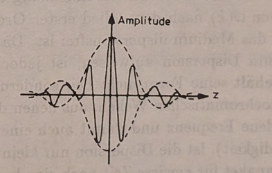
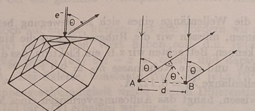
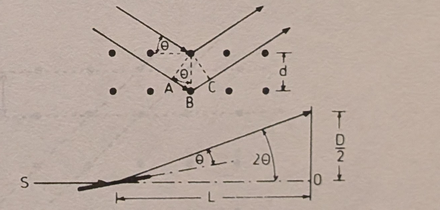
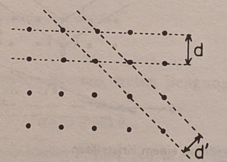

# Chapter 3 — The Wave Aspect of Matter
*(Der Wellenaspekt der Materie)*

> Source: Walter Greiner, *Quantum Mechanics: An Introduction*, Chapter 3.
> Screenshots: [`source/p37.jpg`](source/) – [`source/p46.jpg`](source/).

**Theme of the chapter.** Chapter 2 ended with light forced to be *both* wave and
particle, the balance set by how many photons occupy a mode. De Broglie's leap
was to run the duality **backwards**: if light — long thought a pure wave — also
behaves as particles, then matter — long thought pure particles — should also
behave as a wave. This section postulates that **every** free particle of energy
$E$ and momentum $\vec p$ has a wave of frequency $\nu = E/h$ and wavevector
$\vec k = \vec p/\hbar$ attached to it, builds the plane wave and the wave packet
that represent it, and shows two things that look paradoxical but are not: the
matter wave's **phase velocity exceeds $c$**, yet its **group velocity equals the
particle's ordinary velocity**. The chapter closes with the experiments
(Davisson–Germer, Thomson, Debye–Scherrer) that turned the hypothesis into fact
by diffracting electrons off crystals — and sets the stage for the Schrödinger
equation, which is the wave equation these de Broglie waves must obey.

---

## 3.1 The de Broglie relations and the matter wave
*(Die de Broglieschen Wellen)*

<!-- source: source/p37.jpg, source/p38.jpg -->

### The hypothesis

For a photon the wave picture (frequency $\nu$, wavevector $\vec k$) and the
particle picture (energy $E$, momentum $\vec p$) are tied together by

$$
E = h\nu = \hbar\omega \qquad (1)
$$

$$
\vec p = \hbar\vec k = \frac{h}{\lambda}\frac{\vec k}{|\vec k|} \qquad (2)
$$

These are known to be correct for the electromagnetic field. **De Broglie
postulated that they hold for *all* particles** — an electron of mass $m$ drifting
freely at velocity $\vec v$ included. "What is right for the photon should be right
for every particle." Here $\omega = 2\pi\nu$ is the angular frequency, $\hbar =
h/2\pi$, and $\lambda$ the wavelength; Eq. (2) just says the momentum points along
$\vec k$ with magnitude $p = h/\lambda$.

Granting (1) and (2), each free particle is assigned — up to an amplitude $A$ — a
**plane wave**:

$$
\psi(\vec r,t) = A e^{i(\vec k\cdot\vec r - \omega t)} \qquad (3)
$$

Using (1) and (2) to trade the wave quantities for the mechanical ones
($\vec k = \vec p/\hbar$, $\omega = E/\hbar$) rewrites the exponent in terms of
$\vec p$ and $E$:

$$
\psi(\vec r,t) = A e^{(i/\hbar)(\vec p\cdot\vec r - E t)} \qquad (3a)
$$

This $\psi$ is the object the rest of quantum mechanics is built on. For now it is
only a postulate; its meaning (a probability amplitude) and its equation of motion
(Schrödinger's) come later.

### The de Broglie wavelength

From (2) with $p = mv$ the assigned wavelength is

$$
\lambda = \frac{h}{p} = \frac{h}{mv} \qquad (4)
$$

the second form holding only for particles with non-zero rest mass. Because
$h$ is so tiny ($\approx 6.6\times 10^{-34}\ \text{J s}$), $\lambda$ is measurable
only when $mv$ is small enough — which is why the wave character of matter shows up
only at the **atomic scale** and never for everyday objects. (A thrown baseball
has $\lambda \sim 10^{-34}\ \text{m}$, utterly unobservable; a slow electron has
$\lambda \sim 1\ \text{Å}$, the size of an atom.)

### Phase of the wave and the phase velocity

Write the phase of (3) as

$$
\alpha = \omega t - \vec k\cdot\vec r
$$

(so the exponent is $-i\alpha$). A surface of constant phase is what we watch when
we ask how fast the wave "moves." Holding $\alpha$ fixed and differentiating along
the motion,

$$
\frac{d\alpha}{dt} = \omega - \vec k\cdot\dot{\vec r}
 = \omega - \vec k\cdot\vec u = 0
$$

where $\vec u = \dot{\vec r}$ is the velocity of the constant-phase surface. Since
$\vec k$ and $\vec u$ point the same way, the magnitude of the **phase velocity** is

$$
|\vec u| = \frac{\omega}{k} \qquad (\ast)
$$

**Symbols recap.** $\alpha$ — phase; $\vec u$ — phase velocity (speed of a
constant-phase surface); $k = |\vec k| = 2\pi/\lambda$ — wavenumber.

---

## 3.2 Matter waves disperse even in vacuum
*(Dispersion im Vakuum)*

<!-- source: source/p38.jpg, source/p39.jpg -->

To evaluate $u = \omega/k$ we need $\omega$ as a function of $k$ — the **dispersion
relation**. This is where matter waves part company with light. Start from the
relativistic energy–momentum relation for a free particle,

$$
E^2 = m_0^2 c^4 + p^2 c^2
$$

with $m_0$ the rest mass. For $v \ll c$ expand the square root
($E = mc^2 = \sqrt{m_0^2c^4 + p^2c^2} = m_0 c^2\sqrt{1 + p^2/m_0^2c^2}$):

$$
E = \sqrt{m_0^2 c^4 + p^2 c^2} = m_0 c^2 + \frac{p^2}{2m_0} + \cdots
$$

— the rest energy plus the familiar Newtonian kinetic energy $p^2/2m_0$. Dividing
by $\hbar$ and putting $p = \hbar k$ gives $\omega(k) = E/\hbar$ as a function of
the wavenumber:

$$
\omega(k) = \frac{m_0 c^2}{\hbar} + \frac{\hbar k^2}{2m_0} + \cdots \qquad (5)
$$

The decisive point: **$\omega$ depends on $k$ non-linearly** (the $k^2$ term). For
electromagnetic waves in vacuum $\omega = ck$ is exactly linear, so all
wavelengths travel at the same speed and there is *no* dispersion. The de Broglie
wave already disperses **in empty space** — waves of different wavelength move at
different phase velocities:

$$
u = \frac{\omega}{k} = \frac{m_0 c^2}{\hbar k} + \frac{\hbar k}{2m_0} + \cdots
$$

### Phase velocity exceeds $c$ — and why that is harmless

There is a cleaner exact form. Using (1) and (2) directly,

$$
u = \frac{\omega}{k} = \frac{\hbar\omega}{\hbar k} = \frac{E}{p}
 = \frac{mc^2}{mv} = \frac{c^2}{v}
$$

Since the particle is massive it moves slower than light, $v < c$, so

$$
u = \frac{c^2}{v} > c
$$

The phase velocity of a matter wave is **always greater than the vacuum speed of
light**. This cannot be the speed of the particle (which is massive and subluminal),
and it does *not* violate relativity: a single infinite plane wave of one fixed
frequency carries no signal and transports no energy — it is the same everywhere
for all time, so "how fast its crests move" is not the speed of anything physical.
Information and energy travel at the **group** velocity, computed next, which we
will find equals $v < c$.

---

## 3.3 Group velocity equals the particle velocity
*(Die Gruppengeschwindigkeit)*

<!-- source: source/p39.jpg -->

The **group velocity** — the speed at which a localized disturbance (a packet of
nearby wavenumbers) travels — is

$$
v_g = \frac{d\omega}{dk} = \frac{d(\hbar\omega)}{d(\hbar k)} = \frac{dE}{dp}
$$

the last step just multiplying top and bottom by $\hbar$ via (1) and (2). So
$v_g = dE/dp$, and we can get this without re-differentiating (5) by a short
mechanical argument.

**A force argument for $dE/dp = v$.** Push the particle with a force $\vec F$
through a displacement $d\vec s$. The work–energy theorem gives the energy change
$dE = \vec F\cdot d\vec s$, and Newton's law gives $\vec F = d\vec p/dt$. Hence

$$
dE = \frac{d\vec p}{dt}\cdot d\vec s = d\vec p\cdot\vec v
$$

since $d\vec s/dt = \vec v$. Because $\vec v$ and $\vec p$ are parallel,
$d\vec p\cdot\vec v = v dp$, so

$$
\frac{dE}{dp} = v \qquad\Longrightarrow\qquad
\boxed{v_g = v}
$$

**The group velocity of the matter wave is the ordinary velocity of the particle.**
(The same falls straight out of differentiating $E = \sqrt{m_0^2c^4 + p^2c^2}$:
$dE/dp = pc^2/E = mvc^2/mc^2 = v$.) This is the resolution promised above — the
*phase* velocity $c^2/v$ is superluminal and unphysical as a transport speed, but
the *group* velocity, which is what actually carries the particle's energy and
"whereabouts," is exactly $v$.

> **Why this matters.** Two velocities, two jobs. The phase velocity tracks the
> crests of an idealized infinite wave and may exceed $c$; the group velocity
> tracks the *envelope* — the lump of probability that is the particle — and obeys
> $v_g = v < c$. Keeping them distinct is what makes the wave picture compatible
> with a localized, subluminal particle.

---

## 3.4 The wave packet
*(Das Wellenpaket)*

<!-- source: source/p40.jpg, source/p41.jpg, source/p42.jpg -->

A single plane wave (3) fills all space and cannot represent a particle that is
*here* and not *there*. To localize it we superpose a narrow band of wavenumbers
around a central $k_0$ — a **wave packet**. Taking a group running along $x$:

$$
\psi(x,t) = \int_{k_0-\Delta k}^{k_0+\Delta k} c(k) e^{i(kx - \omega(k)t)} dk
\qquad (6)
$$

Here $k_0 = 2\pi/\lambda_0$ is the mean wavenumber and $\Delta k$ measures the
packet's spread in wavenumber, assumed small ($\Delta k \ll k_0$). Because the band
is narrow we may **Taylor-expand** $\omega(k)$ about $k_0$ and drop terms of order
$(k-k_0)^2$ and higher:

$$
\omega(k) = \omega(k_0) + \left(\frac{d\omega}{dk}\right)_{k_0}(k-k_0)
 + \frac{1}{2}\left(\frac{d^2\omega}{dk^2}\right)_{k_0}(k-k_0)^2 + \cdots \qquad (7)
$$

Introduce $\xi = k - k_0$ as the integration variable and identify the
first-derivative coefficient as the group velocity,
$(d\omega/dk)_{k_0} \equiv v_g$. To first order $\omega(k) = \omega(k_0) + v_g\xi$,
and the exponent splits cleanly:

$$
kx - \omega(k)t = \big[k_0 x - \omega(k_0)t\big] + \xi\big(x - v_g t\big)
$$

so

$$
\psi(x,t) = e^{i(k_0 x - \omega(k_0)t)}
\int_{-\Delta k}^{\Delta k} e^{i(x - v_g t)\xi} c(k_0+\xi) d\xi \qquad (6a)
$$

### Doing the integral

Treat the amplitude as slowly varying across the narrow band, $c(k_0+\xi)\approx
c(k_0)$, and pull it out. The remaining integral is elementary:

$$
\int_{-\Delta k}^{\Delta k} e^{i(x-v_g t)\xi} d\xi
 = \frac{e^{i(x-v_g t)\Delta k} - e^{-i(x-v_g t)\Delta k}}{i(x-v_g t)}
 = \frac{2\sin\big(\Delta k (x-v_g t)\big)}{x - v_g t}
$$

Therefore

$$
\psi(x,t) = C(x,t) e^{i(k_0 x - \omega(k_0)t)} \qquad (8)
$$

$$
C(x,t) = 2 c(k_0)\frac{\sin\big(\Delta k (x - v_g t)\big)}{x - v_g t} \qquad (8')
$$

The packet is a **carrier wave** $e^{i(k_0 x - \omega(k_0)t)}$, oscillating fast at
the mean wavenumber/frequency, multiplied by a slowly varying **envelope**
$C(x,t)$.

### Reading the envelope: a $\sin z / z$ shape

Put $z = \Delta k (x - v_g t)$, so $C \propto \sin z / z$. This function

$$
\lim_{z\to 0}\frac{\sin z}{z} = 1 \quad (z=0), \qquad
\frac{\sin z}{z} = 0 \quad (z = \pm\pi),
$$

has a tall central peak at $z = 0$ and only small, fast-decaying side lobes. So the
superposition is **localized**: $|\psi|$ is appreciable only in a finite region —
the particle — and falls off like $\sin z/z$ away from the center.

<!-- figure: cropped from source/p41.jpg -->
Several fast-oscillating waves of slightly different wavenumber superpose into one
spatially bounded group. The rapid wiggle is the carrier at $k_0$; the dashed
bell is the envelope $C(x,t) \propto \sin z/z$ with $z = \Delta k(x - v_g t)$.

### The packet moves at $v_g$

The central maximum sits where $z = 0$, i.e.

$$
x - v_g t = 0 \qquad\Longrightarrow\qquad \frac{dx}{dt} = v_g
$$

so the surface of fixed amplitude — and the whole packet with it — travels at the
group velocity. The same follows from demanding $|\psi(x,t)|^2 = \text{const}$: by
(8) this needs $x - v_g t = \text{const}$, hence $\dot x = v_g$ again. Differentiating
the dispersion relation (5) pins the value down nonrelativistically:

$$
v_g = \left(\frac{d\omega}{dk}\right)_{k_0}
 = \left(\frac{\hbar k}{m_0}\right)_{k_0}
 = \frac{\hbar k_0}{m_0} = \frac{p}{m_0} = v
$$

consistent with §3.3.

### A caveat: the packet spreads

The clean result $v_g = v$ used only the **first-order** term in (7). But matter
waves disperse in vacuum, so the second derivative does **not** vanish:

$$
\frac{d^2\omega}{dk^2} = \frac{\hbar}{m_0} \neq 0
$$

Each monochromatic component travels at a slightly different speed, so the packet
does not keep its shape — it gradually **spreads** (*zerfließt*). Only while the
dispersion term is negligibly small ($d^2\omega/dk^2 \approx 0$) may we treat the
packet as a rigid lump moving as a whole at $v_g$. Over longer times the
spreading must be accounted for — a genuinely quantum feature we return to when
solving the Schrödinger equation.

---

## 3.5 The de Broglie wavelength: formulas and numbers
*(Wellenlänge und Auflösungsvermögen)*

<!-- source: source/p42.jpg, source/p43.jpg -->

From $k = 2\pi/\lambda$ and $p = \hbar k$ the assigned wavelength is

$$
\lambda = \frac{2\pi}{k} = \frac{2\pi\hbar}{p} = \frac{h}{p}
$$

For a non-relativistic particle ($v \ll c$) the kinetic energy is $E = p^2/2m_0$,
so $p = \sqrt{2m_0 E}$ and

$$
\boxed{\lambda = \frac{h}{\sqrt{2m_0 E}}} \qquad (9)
$$

To get the wavelength of a moving particle you need its **rest mass and kinetic
energy**.

**Worked number — a 10 keV electron.** With $m_0 = 9.1\times 10^{-28}\ \text{g}$
and $E = 10\ \text{keV}$, Eq. (9) gives

$$
\lambda_e \approx 0.122\ \text{Å}
$$

(Check: $\lambda = h/\sqrt{2m_0E}$ with $h = 6.6\times 10^{-34}\ \text{J s}$,
$m_0 = 9.1\times 10^{-31}\ \text{kg}$, $E = 1.6\times 10^{-15}\ \text{J}$ gives
$1.2\times 10^{-11}\ \text{m}$.) This is far shorter than visible light and
comparable to atomic spacings — already a hint that electrons can probe matter at
the atomic scale.

### Why short wavelengths mean sharp microscopes

A microscope's **resolving power** is limited by the wavelength of whatever
"illuminates" the object: the smaller $\lambda$, the smaller the separation of two
points that can still be told apart (cf. Example 3.7). Visible light has
$\lambda_L \approx 5000\ \text{Å}$, which limits an optical microscope to about
$2000\times$ magnification.

- **Electron microscope.** Replacing light by electrons (whose $\lambda$ is
  hundreds of times shorter, as just computed) reaches up to $\sim 500{,}000\times$
  magnification and a resolution of about $5$–$10\ \text{Å}$.
- **High-energy probes.** Protons and mesons at GeV energies ($10^9\ \text{eV}$)
  have wavelengths of $10^{-14}$–$10^{-15}\ \text{cm}$, short enough to resolve the
  **internal structure of elementary particles** themselves.

> **The unifying idea.** "Seeing small" is "diffracting short waves." Whether the
> wave is light or an electron beam or a GeV proton, the resolution is set by
> $\lambda = h/p$ — so to look deeper you raise the momentum. This single
> relation links optical microscopes, electron microscopes, and particle
> accelerators on one scale.

---

## 3.6 Diffraction of matter beams
*(Beugung von Materiestrahlen)*

<!-- source: source/p43.jpg, source/p44.jpg, source/p45.jpg -->

Interference and diffraction are unambiguous signatures of **waves** — in
particular, destructive interference has no corpuscular explanation. Just as the
photoeffect and Compton effect (Chapter 1) revealed the *particle* nature of
light, **diffraction of electron beams** is the direct evidence for matter waves.

Electron wavelengths (fractions of an Å) are far too short for a ruled artificial
grating, so one uses the regular spacing of a **crystal lattice** as the grating.
The experiments essentially repeat, with electron beams, the structure analyses
done earlier with X-rays.

### Davisson–Germer: a crystal surface as a plane grating

Davisson and Germer applied the **Laue method**: the surface of a single crystal
acts as a *plane* diffraction grating. The electrons are diffracted at the surface
and do not penetrate the crystal. Diffraction maxima appear under the
plane-grating condition

$$
n\lambda = d\sin\theta
$$

with $d$ the spacing of surface rows, $\theta$ the diffraction angle, and $n$ an
integer.

<!-- figure: cropped from source/p44.jpg -->
Electrons strike the crystal surface and are diffracted; the path difference
between adjacent scattering centers a distance $d$ apart is $d\sin\theta$, so
constructive interference (a maximum) occurs when this equals a whole number of
wavelengths, $n\lambda = d\sin\theta$.

If the electron is accelerated through a voltage $U$, its kinetic energy is
$E = eU$, and inserting Eq. (9) gives $\lambda = h/\sqrt{2m_0 eU}$, which turns the
condition into a relation between voltage and angle:

$$
n\frac{h}{d\sqrt{2m_0 e}} = \sqrt{U}\sin\theta
$$

confirmed by the measurements.

### Thomson and the Debye–Scherrer powder method

Tartakowski and G. P. Thomson instead used the **Debye–Scherrer** technique:
monochromatic radiation is scattered from a body of **pressed crystal powder**.
The powder is a three-dimensional grating of randomly oriented crystallites, so —
whatever the beam direction — *some* crystallites are always oriented to satisfy
the reflection condition. Here the relevant condition is **Bragg reflection** from
lattice planes a distance $d$ apart,

$$
2d\sin\theta = n\lambda \qquad (\text{Wulf--Bragg})
$$

<!-- figure: cropped from source/p45.jpg -->
A matter wave Bragg-reflects off a favorably oriented crystallite (upper sketch,
spacing $d$, glancing angle $\theta$). Because crystallites take all orientations,
the apparatus is symmetric about the beam axis $\overline{SO}$, so the pattern on a
screen a distance $L$ away is a set of concentric rings of radius $D/2$ at
deflection $2\theta$.

**The ring geometry.** By the radial symmetry the screen pattern is rings about the
forward point $O$, with

$$
\tan(2\theta) = \frac{D}{2L}
$$

where $L$ is the screen distance and $D$ the ring diameter. The angles are kept so
small that $\tan(2\theta) \approx 2\theta$ and $\sin\theta\approx\theta$. Combining
the small-angle form $2\theta \approx D/2L$ (so $\theta \approx D/4L$) with the
Bragg condition $2d\theta = n\lambda$:

$$
2d\cdot\frac{D}{4L} = n\lambda \qquad\Longrightarrow\qquad
\boxed{Dd = 2nL\lambda}
$$

Finally, for electrons accelerated through $U$, substituting
$\lambda = h/\sqrt{2m_0 eU}$:

$$
D\sqrt{U} = \frac{2nLh}{d\sqrt{2m_0 e}}
$$

The experimental results agreed completely. Today electron beams — and even more
so **neutron beams** — are an essential tool of solid-state physics for
determining crystal structures.

> **Two conditions, one idea.** The surface (Davisson–Germer) experiment uses the
> plane-grating law $n\lambda = d\sin\theta$; the powder (Debye–Scherrer)
> experiment uses Bragg reflection $2d\sin\theta = n\lambda$ from stacks of
> lattice planes (the factor $2$ is the extra path down to and back from the
> second plane). Both are the *same* statement — constructive interference when
> the path difference is a whole number of de Broglie wavelengths — applied to a
> 2D row of scatterers versus a 3D stack of planes.

---

## 3.7 Exercise 3.1 — diffraction patterns of monochromatic X-rays
*(Beugungsbilder monochromatischer Röntgenstrahlung)*

<!-- source: source/p46.jpg -->

**(a) An ideal single crystal in a monochromatic beam.** An ideal crystal is a
perfectly regular array of atoms; incoming radiation of wavelength $\lambda$ is
weakly reflected by each family of lattice planes, but a macroscopic reflection
appears only when the reflections from one family of parallel planes interfere
constructively — the **Bragg condition** $2d\sin\vartheta = n\lambda$ (with $n$
integer, $\vartheta$ the angle between beam and net plane).

<!-- figure: cropped from source/p46.jpg -->
The same crystal lattice can be sliced into many different families of parallel
net planes — two are shown, with spacings $d$ and $d'$. Each family has its own
spacing and its own orientation, hence its own fixed Bragg angle, which is why a
single monochromatic beam usually satisfies none of them.

The catch: for an *ideal, fixed* crystal the orientation already fixes $\vartheta$
for each plane family, and $d$ and $\lambda$ are fixed too. With $d$, $\vartheta$,
and $\lambda$ all determined, there is in general **no integer $n$** that satisfies
$2d\sin\vartheta = n\lambda$ — so usually **no reflection occurs at all**. To get a
pattern one must relax one of the fixed quantities:

- **Laue method** — illuminate with a *continuous* (white) spectrum instead of
  monochromatic light; then for each plane family some wavelength satisfies Bragg,
  and the pattern is a set of regular, discrete **spots**.
- **Rotating-crystal method** — vary $\vartheta$ by turning the crystal, sweeping
  different planes through the Bragg condition in turn.

**(b) Debye–Scherrer powder.** With a powder rather than a single crystal, the
crystallites take *all* orientations, so for any wavelength some grains always
satisfy Bragg. Each plane family then reflects into a **cone** about the beam, and
the pattern on the screen is a set of concentric **rings** (as in §3.6) rather than
isolated spots.

> **Why a powder rescues a monochromatic beam.** A single fixed crystal gives you
> one orientation and almost certainly misses the Bragg condition. A powder is, in
> effect, a single crystal "averaged over all rotations at once" — it offers every
> $\vartheta$ simultaneously, so a fixed $\lambda$ always finds matching grains.
> This is exactly why powder diffraction is the workhorse method for materials
> with no large single crystals available.

---

## Chapter summary (so far)

| Result | Expression | Meaning |
|---|---|---|
| de Broglie relations | $E = \hbar\omega$, $\vec p = \hbar\vec k$ | wave–particle dictionary |
| Matter plane wave | $\psi = A e^{(i/\hbar)(\vec p\cdot\vec r - Et)}$ | free-particle wavefunction |
| de Broglie wavelength | $\lambda = h/p = h/\sqrt{2m_0E}$ | sets the scale of wave effects |
| Dispersion (vacuum) | $\omega(k) = m_0c^2/\hbar + \hbar k^2/2m_0 + \cdots$ | matter waves disperse in empty space |
| Phase velocity | $u = \omega/k = c^2/v > c$ | crests of the ideal wave; carries nothing |
| Group velocity | $v_g = d\omega/dk = dE/dp = v$ | speed of the packet; equals particle speed |
| Wave packet | $\psi = C(x,t) e^{i(k_0x - \omega_0 t)}$, $C \propto \sin z/z$ | localized particle; spreads since $d^2\omega/dk^2\neq 0$ |
| Plane grating, surface | $n\lambda = d\sin\theta$ | Davisson–Germer |
| Bragg reflection | $2d\sin\theta = n\lambda$ | Debye–Scherrer powder; rings $Dd = 2nL\lambda$ |

**The lesson.** De Broglie's postulate $\lambda = h/p$ promotes the wave–particle
duality from a property of light to a property of *all* matter. The matter wave is
genuinely dispersive even in vacuum, which forces a careful split between phase
velocity (superluminal, physically inert) and group velocity (equal to the
particle's velocity, carrying the energy). The localized particle is a wave
packet that moves at $v_g = v$ but inexorably spreads — the first quantitative
sign that a particle's position is not a sharp, permanent thing. Electron
diffraction off crystals turned all of this from hypothesis into measured fact.
