# Chapter 3 — The Wave Aspect of Matter (Part 2)
*(Der Wellenaspekt der Materie)*

> Source: Walter Greiner, *Quantum Mechanics: An Introduction*, Chapter 3.
> Screenshots: [`source/p62.jpg`](source/) – [`source/p83.jpg`](source/).

> **Note.** Chapter 3 is split across two files because GitHub silently stops
> rendering LaTeX after roughly a thousand math expressions on one page.
> **[Part 1: §3.1–3.14](notes.md).**
> **Part 2 (this file): §3.15–3.27 + chapter summary.**

**Where part 1 left off.** Part 1 built the matter wave (§§3.1–3.6), confirmed
it by diffraction (§§3.7–3.8), and developed Born's statistical interpretation
into a working toolkit: normalization and box normalization, the plane-wave
basis and Hilbert space, mean values, and the operator dictionary ending with
the Hamiltonian (§§3.9–3.14). Part 2 puts the toolkit to work: the
superposition principle, the uncertainty relation (heuristic, then exact), the
gallery of measurement thought-experiments, and the chapter's worked exercises.

---

## 3.15 The superposition principle of quantum mechanics
*(Das Superpositionsprinzip der Quantenmechanik)*

<!-- source: source/p62.jpg -->

One of the most important basic principles of quantum mechanics is that of
the **linear superposition of states**. If a quantum-mechanical system can
occupy the discrete states $\psi_n$ ($n \in \mathbb{N}$), then it can also be
in the state

$$
\psi = \sum_n a_n\psi_n \qquad (30)
$$

— *simultaneously containing* all the $\psi_n$, weighted by complex amplitudes
$a_n$. For the probability density of such a superposition:

$$
w = \sum_{n,m} a_n a_m^\ast\ \psi_n\psi_m^\ast = \psi\psi^\ast
$$

The double sum is the point: besides the diagonal terms $|a_n|^2|\psi_n|^2$
(which a classical mixture would also have), there are **cross terms**
$a_n a_m^\ast \psi_n\psi_m^\ast$ with $n \neq m$ — the **interference terms**.
Amplitudes superpose first, and only then is the modulus squared taken; that
ordering is the entire difference between quantum superposition and classical
probability mixing. (Chapter 1's opening observation that light added to
light can produce *darkness* is this same amplitude arithmetic; and the
neutron interferometer of §3.27 reads such a cross term out directly — its
$I_0 \sim 1 + \cos\chi$ is nothing but the interference term between the two
path amplitudes.)

This physical fact corresponds to the mathematical fact that every possible
wavefunction $\psi$ can be expanded in an orthogonal complete function system
$\psi_n$ — which is precisely what Eq. (21) did with the plane waves. If the
system can assume a *continuous* family of states $\varphi_f$ with respect to
some physical quantity $f$, the sum becomes an integral and the state

$$
\psi = \int c_f\ \varphi_f\ df \qquad (31)
$$

is also realized.

**Consequence for the dynamics.** The wave equation for $\psi$ must be a
**linear differential equation** (cf. Chapter 6). Only then is the
superposition principle consistent with the dynamics: if the $\psi_n$ solve
the fundamental linear equation, then by linearity every combination of type
(30) solves it too. (This requirement will drastically narrow the search for
the Schrödinger equation.)

---

## 3.16 Example 3.4 — superposition of plane waves and the momentum probability
*(Superposition ebener Wellen, Impulswahrscheinlichkeit)*

<!-- source: source/p63.jpg, source/p64.jpg -->

This example redoes the entire box story of §§3.10–3.11 in **infinite space**,
where the momentum label is continuous. It is the practical face of Eq. (31).

### Delta-normalized de Broglie waves

Represent a wave field $\psi(\vec r, t)$ by superposing de Broglie waves

$$
\psi_{\vec p}(\vec r,t) = \frac{1}{(2\pi\hbar)^{3/2}}\ e^{i\frac{\vec p\cdot\vec r - Et}{\hbar}} \qquad (1')
$$

Where does the normalization factor $(2\pi\hbar)^{-3/2}$ come from? Compute
the overlap of two such waves with momenta $\vec p$ and $\vec p'$, regulating
the infinite integral by a box of half-width $g$ and letting $g \to \infty$:

$$
\int_{-\infty}^{\infty}\psi_{\vec p}^\ast\psi_{\vec p'}\ d^3r = \lim_{g\to\infty} N^2\int_{-g}^{g} e^{-\frac{i}{\hbar}(\vec p - \vec p')\cdot\vec r}\ d^3r = \lim_{g\to\infty} N^2\ 2\frac{\sin\left(g\frac{p_x-p_x'}{\hbar}\right)}{\frac{p_x-p_x'}{\hbar}}\ 2\frac{\sin\left(g\frac{p_y-p_y'}{\hbar}\right)}{\frac{p_y-p_y'}{\hbar}}\ 2\frac{\sin\left(g\frac{p_z-p_z'}{\hbar}\right)}{\frac{p_z-p_z'}{\hbar}}
$$

Each 1D factor is the familiar $2\sin(g\xi)/\xi$ spike (the same integral as
in the wave packet of §3.4), and the delta-function representation

$$
\delta(x) = \frac{1}{\pi}\lim_{g\to\infty}\frac{\sin(gx)}{x}, \qquad \delta(ax) = a^{-1}\delta(x)
$$

turns the triple product into

$$
\int_{-\infty}^{\infty}\psi_{\vec p}^\ast\psi_{\vec p'}\ d^3r = N^2(2\pi)^3\ \delta\left(\frac{\vec p - \vec p'}{\hbar}\right) = N^2(2\pi\hbar)^3\ \delta(\vec p - \vec p')
$$

(the scaling rule, applied once per dimension, converts
$\delta((\vec p - \vec p')/\hbar)$ into $\hbar^3\delta(\vec p - \vec p')$).
Since a free particle has **no discrete momenta**, normalization to one is
impossible; instead one normalizes **to the delta function**:

$$
\int_{-\infty}^{\infty}\psi_{\vec p'}\psi_{\vec p}^\ast\ d^3r = \delta(\vec p - \vec p')
$$

which fixes

$$
N = (2\pi\hbar)^{-3/2}
$$

This is the continuum analogue of orthonormality (19): the Kronecker delta
$\delta_{\vec k\vec k'}$ has become the Dirac delta $\delta(\vec p - \vec p')$.

### An arbitrary state is a Fourier integral over de Broglie waves

The wavefunction of an arbitrary state is then

$$
\psi(\vec r, t) = \int_{-\infty}^{\infty} c(\vec p, t)\ \psi_{\vec p}(\vec r,t)\ d^3p \qquad (2')
$$

where the expansion coefficients $c(\vec p, t)$ — the amplitudes of the
partial de Broglie waves, cf. Eq. (31) — replace the discrete $a_{\vec k}$.
Equation (2') is nothing but a **threefold Fourier integral**. The Fourier
formula reads

$$
\psi(\vec r, t) = \frac{1}{(2\pi)^3}\int_{-\infty}^{\infty}\varphi(\vec p, t)\ e^{+i\vec k\cdot\vec r}\ d^3k \qquad (3')
$$

where $\varphi(\vec p, t)$ is the Fourier transform of $\psi(\vec r, t)$.
Substituting $\vec k = \vec p/\hbar$ (so $d^3k = d^3p/\hbar^3$) in (3'):

$$
\psi(\vec r, t) = \frac{1}{(2\pi)^3}\int_{-\infty}^{\infty}\varphi(\vec p, t)\ e^{+i\frac{\vec p\cdot\vec r}{\hbar}}\ \frac{d^3p}{\hbar^3}
$$

and the inverse transform is, analogously,

$$
\varphi(\vec p, t) = \int_{-\infty}^{\infty}\psi(\vec r, t)\ e^{-i\frac{\vec p\cdot\vec r}{\hbar}}\ d^3r
$$

Comparing (1') inserted into (2') against the Fourier form (3') identifies the
two descriptions:

$$
\varphi(\vec p, t) = (2\pi\hbar)^{3/2}\ c(\vec p, t)\ e^{-i\frac{Et}{\hbar}}
$$

— the Fourier transform $\varphi$ and the expansion coefficient $c$ agree up
to the normalization constant and the free time phase $e^{-iEt/\hbar}$ carried
by each de Broglie wave.

### Parseval again, and the momentum-space density

One can now show (it is Parseval's theorem, the continuum version of Eq. (20)):

$$
\int_{-\infty}^{\infty} |c(\vec p, t)|^2\ d^3p = \int_{-\infty}^{\infty} |\psi(\vec r, t)|^2\ d^3r = 1
$$

The probability of finding the momentum in the interval
$p_x, p_x + dp_x$; $p_y, p_y + dp_y$; $p_z, p_z + dp_z$ is given by the
expansion coefficients:

$$
dW(\vec p, t) = |c(\vec p, t)|^2\ d^3p
$$

and the **probability density in momentum space** is

$$
w(\vec p, t) = |c(\vec p, t)|^2
$$

> **The complete dictionary.** Discrete (box) and continuous (free space) now
> line up perfectly: $\psi_{\vec k} \leftrightarrow \psi_{\vec p}$, sum
> $\leftrightarrow$ integral, $\delta_{\vec k\vec k'} \leftrightarrow
> \delta(\vec p - \vec p')$, $a_{\vec k} \leftrightarrow c(\vec p, t)$,
> $\sum|a_{\vec k}|^2 = 1 \leftrightarrow \int|c|^2 d^3p = 1$. And the pair of
> densities — $|\psi(\vec r,t)|^2$ for position, $|c(\vec p,t)|^2$ for
> momentum — are Fourier transforms of one another (up to phases). That last
> fact is not a curiosity; it is the mathematical engine of the uncertainty
> relation, coming next: a function and its Fourier transform cannot both be
> narrow.

---

## 3.17 The Heisenberg uncertainty relation — the heuristic version
*(Die Heisenbergsche Unschärferelation)*

<!-- source: source/p64.jpg, source/p65.jpg, source/p66.jpg -->

### The claim

The wave character of matter — the fact that the corpuscles are guided by the
field $\psi(x,t)$ — expresses itself in an immediate connection between
position determination and momentum determination in the microphysical
domain: **position and momentum of a particle cannot both be sharply fixed at
the same time.** The quantitative measure of this trade-off is the
**Heisenberg uncertainty relation**. Before deriving it exactly (next
installment), Greiner makes it plausible with the wave packet we already own.

### Reading the trade-off from the wave packet

Take the one-dimensional packet of Eq. (8) at time $t = 0$:

$$
\psi(x,t) = 2c(k_0)\frac{\sin\left(\Delta k(x - v_g t)\right)}{x - v_g t}\ e^{i(k_0 x - \omega_0 t)} \qquad (8)
$$

Its probability density at $t = 0$ is

$$
|\psi|^2 = 4c^2\ \frac{\sin^2(\Delta k\ x)}{x^2}
$$

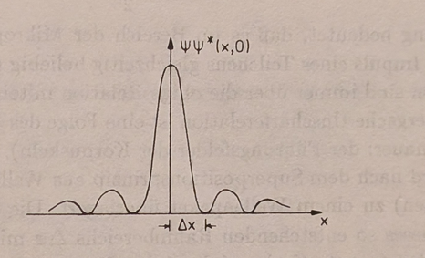

<!-- figure: cropped from source/p65.jpg -->
The probability density of the wave packet (8) at time $t = 0$: a tall
central lobe of half-width $\Delta x$ flanked by small side lobes.

Characterize the packet's spatial extent by $\Delta x$, the distance from the
central maximum to the **first minimum**. The minima are the zeros of the
density,

$$
|\psi|^2 = 4c^2\frac{\sin^2(\Delta k\ x)}{x^2} = 0
$$

i.e. $\sin(\Delta k\ x) = 0$ with $x \neq 0$; the first zero sits at
$\Delta k\ x = \pi$. So the first minimum obeys

$$
\Delta k\ \Delta x = \pi
$$

This is pure wave kinematics — the same relation any signal analyst knows: a
pulse built from a band of wavenumbers of width $\Delta k$ cannot be narrower
than $\sim \pi/\Delta k$. Now insert de Broglie, $\Delta p = \hbar\Delta k$,
and the statement becomes mechanics:

$$
\Delta x\ \Delta p = \pi\hbar = \frac{h}{2}
$$

**an estimate of the Heisenberg uncertainty relation between position and
momentum.** In the microphysical domain it is impossible to determine both
the position and the momentum of a particle simultaneously with arbitrary
precision; the two are always linked by a relation of this order.

> **Do not memorize the right-hand side yet.** The value $h/2 = \pi\hbar$
> reflects this particular packet shape *and* this particular width
> convention (first zero of a $\sin z/z$ envelope). The sharp, universal
> statement — $\Delta x\ \Delta p \geq \hbar/2$ with root-mean-square
> deviations, saturated by Gaussian packets — is exactly what the announced
> *exact* derivation (and Chapter 4) will deliver. What is convention-proof
> is the scaling: the product of the two widths is bounded below by something
> of order $\hbar$.

### Why the uncertainty is a *consequence* of the wave picture

The logic of the guiding-field interpretation makes the relation inevitable.
The probability field is built, per the superposition principle, out of waves
of *sharp momentum* (plane waves). The particle is guided (found) with high
probability only inside the spatial region $\Delta x$ where those waves
interfere constructively. For such a localization $\Delta x$ to happen *at
all*, a range of different plane waves around the central momentum
$\hbar\vec k_0$ is required — a momentum packet of width $\hbar\Delta\vec k$.
Squeeze $\Delta x$ and you must widen the momentum band; purify the momentum
and the packet delocalizes. Position sharpness and momentum sharpness are two
ends of one seesaw.

**The classical antecedent.** Uncertainty relations of identical form occur
in *classical* wave processes. A radio transmitter emitting a spatially
bounded electromagnetic signal necessarily emits a wave packet containing
waves of all frequencies (momenta). To radiate a truly single-frequency
(unifrequent) wave, the transmitter would have to transmit for an infinitely
long time — any switch-on and switch-off transient mixes in other
frequencies — and then the wave fills all of space, so specifying *where* the
signal is becomes impossible. What quantum mechanics adds to this old wave
lore is only (via de Broglie) that it applies to *matter*, with $\hbar$
setting the exchange rate between wavenumber spread and momentum spread.

**Where this is headed.** After this intuitive derivation Greiner announces
the exact one: start from an arbitrary particle state described by a
normalized $\psi$, restrict to one dimension, and first define a proper
*measure* of uncertainty — the deviations of $p_x$ and $x$ from their mean
values (the expectation values of §3.12). That calculation — mean-square
deviations, the role of the commutator, and the Gaussian as the
minimum-uncertainty packet — is where the next batch of pages picks up.

> **Biographical footnotes in the text.** *Max Born* (1882–1970), the founder
> of the statistical interpretation (p. 49, §3.9), built the Göttingen school
> where matrix mechanics was created with Heisenberg and Jordan; Nobel Prize
> 1954. *Werner Heisenberg* (1901–1976) formulated in July 1925 the
> positivist principle that only observable quantities belong in the theory,
> co-created matrix mechanics with Born and Jordan in September 1925, and in
> 1927 published the uncertainty relation, which became a cornerstone of the
> Copenhagen interpretation.

---

## 3.18 The uncertainty relation, exactly: $\Delta x\ \Delta p \geq \hbar/2$
*(Exakte Herleitung der Unschärferelation)*

<!-- source: source/p66.jpg, source/p67.jpg, source/p68.jpg, source/p69.jpg -->

The heuristic argument of §3.17 used one particular packet and one arbitrary
width convention. Now Greiner delivers the promised exact derivation: an
inequality valid for **every** normalized state $\psi$, in one dimension, with
a precisely defined measure of uncertainty.

### Step 1: define what "uncertainty" means

We need a measure for the deviations of $p_x$ and $x$ from their mean values
$\overline{p_x}$ and $\overline{x}$ (the expectation values of §3.12; the
overbar is Greiner's notation for them here). The *average* deviation from the
mean is useless — it vanishes identically, since fluctuations up and down
cancel. So one uses, as everywhere in statistics, the **mean square
deviations** (*mittlere Schwankungsquadrate*):

$$
\overline{\Delta p_x^2} = \overline{(p_x - \overline{p_x})^2} = \overline{p_x^2} - \overline{p_x}^2
$$

$$
\overline{\Delta x^2} = \overline{(x - \overline{x})^2} = \overline{x^2} - \overline{x}^2
$$

(The second forms follow by expanding the square and averaging term by term:
$\overline{(x-\overline x)^2} = \overline{x^2} - 2\overline{x}\ \overline{x} + \overline{x}^2 = \overline{x^2} - \overline{x}^2$.)

**Choosing a convenient frame.** For the further computation pick the
coordinate system whose origin sits at $\overline x$ and moves along with the
center of the distribution. Then

$$
\overline{x} = 0 \qquad \text{and} \qquad \overline{p_x} = 0
$$

and the square deviations simplify to plain second moments:

$$
\overline{\Delta x^2} = \overline{x^2} \qquad \text{and} \qquad \overline{\Delta p_x^2} = \overline{p_x^2}
$$

This costs no generality — shifting the origin and boosting into the packet's
rest frame changes neither spread. Concretely, with the rules of §3.12:

$$
\overline{x^2} = \int \psi^\ast x^2 \psi\ dx, \qquad \overline{p_x^2} = \int \psi^\ast\left(-\hbar^2\frac{\partial^2}{\partial x^2}\right)\psi\ dx = -\hbar^2\int\psi^\ast \frac{\partial^2\psi}{\partial x^2}\ dx
$$

### Step 2: the auxiliary integral

To connect $\overline{x^2}$ and $\overline{p_x^2}$, consider the integral

$$
I(\alpha) = \int_{-\infty}^{\infty}\left|\alpha x\ \psi(x) + \frac{d\psi(x)}{dx}\right|^2 dx, \qquad \alpha\in\mathbb{R}
$$

Because the integrand is a modulus squared, $I(\alpha) \geq 0$ **for every
real $\alpha$** — that single observation is the entire engine of the proof.
Multiply the square out ($|f+g|^2 = f^\ast f + f^\ast g + g^\ast f + g^\ast g$
with $f = \alpha x\psi$, $g = \psi'$):

$$
I(\alpha) = \alpha^2\int_{-\infty}^{\infty} x^2|\psi|^2 dx + \alpha\int_{-\infty}^{\infty} x\left(\frac{d\psi^\ast}{dx}\psi + \psi^\ast\frac{d\psi}{dx}\right)dx + \int_{-\infty}^{\infty}\frac{d\psi^\ast}{dx}\frac{d\psi}{dx}\ dx
$$

Name the three coefficients:

**The quadratic coefficient** is the position spread itself:

$$
A = \int_{-\infty}^{\infty} x^2|\psi|^2\ dx = \overline{\Delta x^2}
$$

**The linear coefficient** — the sum in parentheses is a total derivative,
$\frac{d}{dx}(\psi^\ast\psi)$, so with $B$ defined as its negative:

$$
B = -\int_{-\infty}^{\infty} x\left(\frac{d\psi^\ast}{dx}\psi + \psi^\ast\frac{d\psi}{dx}\right)dx = -\int_{-\infty}^{\infty} x\frac{d}{dx}(\psi^\ast\psi)\ dx = -x\psi^\ast\psi\Big|_{-\infty}^{\infty} + \int_{-\infty}^{\infty}\psi^\ast\psi\ dx = 1
$$

Integration by parts; the boundary term dies because $\psi$ vanishes at
infinity (it must — the state is normalizable), and what remains is the
normalization integral, exactly $1$. This is a small miracle worth savoring:
the cross term evaluates to a pure number, independent of the state.

**The constant coefficient** — integrate by parts once more (boundary term
again zero) to expose the momentum operator:

$$
C = \int_{-\infty}^{\infty}\frac{d\psi^\ast}{dx}\frac{d\psi}{dx}\ dx = \psi^\ast\frac{d\psi}{dx}\Big|_{-\infty}^{\infty} - \int_{-\infty}^{\infty}\psi^\ast\frac{d^2\psi}{dx^2}\ dx = \frac{1}{\hbar^2}\int_{-\infty}^{\infty}\psi^\ast\left(-\hbar^2\frac{d^2}{dx^2}\right)\psi\ dx = \frac{1}{\hbar^2}\overline{\Delta p_x^2}
$$

### Step 3: the discriminant argument

With these abbreviations,

$$
I(\alpha) = A\alpha^2 - B\alpha + C \geq 0
$$

A quadratic polynomial in $\alpha$ that is non-negative for **all** real
$\alpha$ cannot have two distinct real roots — its graph is an upward parabola
that never dips below the axis, so the roots of $I(\alpha) = 0$ must be
complex. That is precisely the statement that the discriminant is
non-positive:

$$
B^2 - 4CA \leq 0
$$

Insert the values $A = \overline{\Delta x^2}$, $B = 1$,
$C = \overline{\Delta p_x^2}/\hbar^2$:

$$
1 \leq 4\ \frac{\overline{\Delta p_x^2}}{\hbar^2}\ \overline{\Delta x^2} \qquad\Longrightarrow\qquad \boxed{\overline{\Delta p_x^2}\ \overline{\Delta x^2} \geq \frac{\hbar^2}{4}}
$$

Taking square roots, with the rms uncertainties
$\Delta x = (\overline{\Delta x^2})^{1/2}$ and
$\Delta p = (\overline{\Delta p_x^2})^{1/2}$:

$$
\Delta x\ \Delta p \geq \frac{\hbar}{2}
$$

**Solely from the experimentally assured wave nature of particles** — from
the existence of a guiding field — it follows that momentum and coordinate of
a particle are *never* simultaneously exactly determined, and hence can never
be *measured* simultaneously with arbitrary accuracy. And the text adds a
reach-extending remark: the same relation will turn out to hold for **other
pairs of physical quantities whose dimensions multiply to the dimension of an
action** (energy and time, angle and angular momentum, ...).

> **Three things hiding in the proof.**
> 1. *Where equality lives.* The bound is saturated exactly when $I(\alpha)=0$
>    for some $\alpha$, i.e. when the integrand vanishes identically:
>    $\alpha x\psi + \psi' = 0$, whose solution is
>    $\psi \propto e^{-\alpha x^2/2}$ — a **Gaussian**. Exercise 3.10 below
>    confirms this by direct computation: the Gaussian packet is the
>    minimum-uncertainty state.
> 2. *Why normalizability mattered.* Both boundary terms vanished because
>    $\psi \to 0$ at $\pm\infty$. A plane wave (not normalizable) escapes the
>    hypotheses — consistently, it has $\Delta p = 0$ and $\Delta x = \infty$.
> 3. *What the trick really is.* $I(\alpha)\geq 0$ plus a discriminant is the
>    classic proof pattern of the **Cauchy–Schwarz inequality**; Chapter 4
>    re-derives the uncertainty relation in that language, with the
>    commutator $[\hat x,\hat p] = i\hbar$ as the star. Note also how much
>    sharper this is than §3.17's estimate $\Delta x\ \Delta p = h/2 = \pi\hbar$:
>    the honest rms bound is $\hbar/2$, a factor $2\pi$ smaller — width
>    conventions matter, orders of magnitude don't.

---

## 3.19 Example 3.5 — position measurement at a slit
*(Ortsmessung am Spalt)*

<!-- source: source/p69.jpg, source/p70.jpg -->

The next four sections are Greiner's gallery of **thought experiments**: every
attempt to *measure* position or momentum runs into the uncertainty relation
through ordinary wave physics. First: localize a particle with a slit.

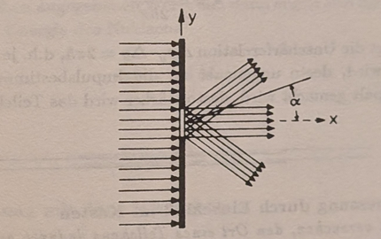

<!-- figure: cropped from source/p69.jpg -->
Localization of a particle by a slit: the plane de Broglie wave arrives from
the left moving in the $x$ direction; passing the slit of width $d$ it fans
out into the diffraction pattern, acquiring momentum components along $y$
within the angle range from $-\alpha$ to $+\alpha$.

A de Broglie wave moving in the $x$ direction passes a perpendicular slit of
width $d = \Delta y$; on a screen parallel to the slit the familiar
diffraction figures appear. Before the slit the beam has $p_y = 0$ **sharp** —
and, consistently, a completely undetermined $y$ position. One might hope
that just after the slit both are known: the slit fixes $y$ to within
$\Delta y = d$, and doesn't the particle still have $p_y = 0$?

No — **the diffraction of the wave group at the slit delivers an extra
momentum component in the $y$ direction.** Because the diffraction is
symmetric, the *mean* stays $\overline{p_y} = 0$; but the spread does not. As
the measure of the momentum spread take the angle $\alpha$ of the **first
diffraction minimum**, since the bulk of the intensity lands between $-\alpha$
and $+\alpha$. For the single slit the first minimum satisfies

$$
\lambda = d\sin\alpha \qquad (\mathrm{i})
$$

(the standard construction: split the slit into halves; at angle $\alpha$ with
$d\sin\alpha = \lambda$ each ray from the upper half finds a partner from the
lower half exactly $\lambda/2$ out of step, so the whole slit cancels
pairwise).

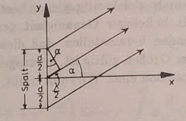

<!-- figure: cropped from source/p70.jpg -->
Geometry of the diffraction at the slit: across the slit of width $d$
(halves $d/2$), the direction $\alpha$ of the first minimum is fixed by a
path difference of $\lambda/2$ between partner rays.

The momentum a deflected particle has picked up along $y$ is the projection

$$
p\sin\alpha = \Delta p_y = \frac{2\pi\hbar}{\lambda}\sin\alpha
$$

using $p = h/\lambda = 2\pi\hbar/\lambda$. Solve this for
$\sin\alpha = \lambda\Delta p_y/2\pi\hbar$ and insert into (i):

$$
\lambda = d\ \frac{\lambda\ \Delta p_y}{2\hbar\pi} \qquad\Longrightarrow\qquad \Delta p_y\ \Delta y = 2\pi\hbar = h
$$

**The trade is explicit and mechanical:** the more precisely the particle's
position is fixed (narrower slit $d$), the more strongly the particle is
deflected (wider diffraction fan $\Delta p_y \approx 2\pi\hbar/d$). The slit
*is* a position measurement, and the diffraction *is* the momentum kick it
costs — no observer, no "disturbance mysticism", just wave optics plus
$p = h/\lambda$.

---

## 3.20 Example 3.6 — position measurement by confinement in a box
*(Ortsmessung durch Einschluß im Kasten)*

<!-- source: source/p70.jpg, source/p71.jpg -->

Second attempt: determine the position of a particle exactly by locking it in
a box and shrinking the box width $l = \Delta x$ toward zero.

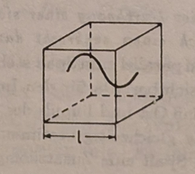

<!-- figure: cropped from source/p70.jpg -->
A particle confined in a box of width $l$: the wavefunction must fit inside,
so its wavelength is of order $l$.

The wavelength of the locked-in particle must fit the box, $\lambda \approx l$,
so the momentum uncertainty is

$$
\Delta p \sim \hbar\ \frac{2\pi}{l}
$$

and the kinetic energy grows as the box shrinks:

$$
E_{\mathrm{kin}} = \frac{\Delta p^2}{2m} \sim \frac{\hbar^2 (2\pi)^2}{2 m l^2}
$$

If the box is made smaller, kinetic energy and momentum **grow** according to
the uncertainty relation. This is not hypothetical — nature runs the
experiment everywhere:

- **Electrons in atoms**: shell diameters $10^{-8}$–$10^{-9}\ \text{cm}$ go
  with electron energies of $10$–$100\ \text{eV}$;
- **Nucleons in nuclei**: sizes $\sim 10^{-12}\ \text{cm}$ go with energies of
  order $1\ \text{MeV}$.

**Checking the nucleon number.** With nuclear diameter
$\Delta x \approx 10^{-12}\ \text{cm}$, $m_N c^2 \approx 938\ \text{MeV}$, and
$\hbar c \approx 197\times 10^{-13}\ \text{cm MeV}$, the uncertainty relation
$\Delta p \approx \hbar\ 2\pi/\Delta x$ gives

$$
\Delta E = \frac{(\Delta p)^2}{2m} \approx \frac{\hbar^2}{2m}\cdot\frac{(2\pi)^2}{(\Delta x)^2} = \frac{(\hbar c)^2}{2\ m_Nc^2}\cdot\frac{(2\pi)^2}{(\Delta x)^2}
$$

and Greiner quotes the result $\Delta E = 0.2\ \text{MeV}$ — the right order
for nuclear level spacings.

> **Bookkeeping note (recorded for honesty).** Numerically,
> $(\hbar c)^2/(2 m_Nc^2 \Delta x^2) = (197\times 10^{-13})^2/(2\cdot 938\cdot 10^{-24})
> \approx 0.2\ \text{MeV}$ — i.e. the printed $0.2\ \text{MeV}$ corresponds to
> $\Delta p \approx \hbar/\Delta x$ *without* the $2\pi$; keeping the
> $(2\pi)^2$ shown in the formula would give $\approx 8\ \text{MeV}$. Same
> game for the electron numbers: $10$–$100\ \text{eV}$ matches the
> $2\pi$-free estimate. No physics hangs on this — these are order-of-magnitude
> statements, and where the $2\pi$ lives is convention — but be aware of it
> when reproducing the arithmetic.

---

## 3.21 Example 3.7 — position measurement with the microscope
*(Ortsmessung mit dem Mikroskop)*

<!-- source: source/p71.jpg, source/p72.jpg -->

Third attempt — the most famous one, Heisenberg's own: *look* at the particle
through a microscope.

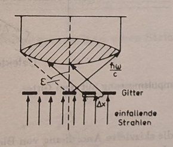

<!-- figure: cropped from source/p71.jpg -->
On the resolving power of the microscope: incident rays come from below, the
scattered photon of momentum $\hbar\omega/c$ must enter the lens within the
half-opening angle $\epsilon$ for the object (structure of size $\Delta x$) to
be resolved.

**What the optics gives.** Let the light bundle illuminating the object run
perpendicular to the $x$-axis. From the theory of the microscope, the
$x$-coordinate of a particle can be determined at best to

$$
\Delta x \approx \frac{\lambda}{\sin\epsilon}
$$

where $\epsilon$ is the half-opening angle of the lens shown in the figure.
One can see this resolution limit directly: for a structure of spacing
$\Delta x$ to be visible, at least its **first diffraction maximum** must
still make it through the lens, i.e. $\Delta x\sin\epsilon = \lambda$. So at
given aperture $\epsilon$ and wavelength $\lambda$, only sizes
$\Delta x \gtrsim \lambda/\sin\epsilon$ are resolved.

**What the imaging costs.** The particle is imaged by a photon scattering off
it and passing through the lens into the microscope. In that scattering the
momenta change as in the **Compton effect**: the particle suffers a recoil of
magnitude $\sim\hbar\omega/c$. But this recoil is not exactly known — the
photon's direction after the scattering is arbitrary **within the cone of
opening angle $2\epsilon$** (anywhere in the lens counts as "detected"). So
of the momentum transfer to the particle we know only that it lies within

$$
\Delta p_x = p\sin\epsilon \approx \frac{\hbar\omega}{c}\sin\epsilon
$$

**The product.** The aperture angle cancels:

$$
\Delta x\ \Delta p_x \approx \lambda\cdot\frac{\hbar\omega}{c} = h
$$

(using $\lambda\omega/c = 2\pi\nu\lambda/c\cdot(1/2\pi)\cdot 2\pi = 2\pi$,
i.e. $\lambda\cdot\hbar\omega/c = \hbar\cdot 2\pi = h$). Sharpening the
image — shorter $\lambda$ or wider $\epsilon$ — hardens the kick in exact
proportion. You can know where the electron *was*, at the price of no longer
knowing where it is *going*.

---

## 3.22 Example 3.8 — momentum measurement with the diffraction grating
*(Impulsmessung mit dem Beugungsgitter)*

<!-- source: source/p72.jpg, source/p73.jpg -->

The mirror-image attempt: measure the *momentum* precisely, and watch position
knowledge evaporate.

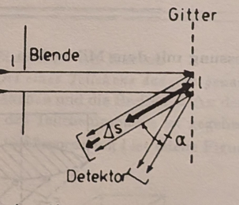

<!-- figure: cropped from source/p72.jpg -->
Principle of momentum measurement with a grating: an aperture ("Blende") cuts
a beam of width $l$ which strikes the grating ("Gitter"); the diffracted beams
at relative angle $\alpha$ only separate after a flight distance, where the
detector ("Detektor") sits; $\Delta s$ is the distance over which the beams
are still mixed.

**The momentum side.** An aperture cuts a particle beam of width $l$, which
falls on a grating of lattice constant $d$; thus the number of grating lines
that matter for the diffraction is

$$
N = \frac{l}{d}
$$

A grating can still separate two waves of different wavelength when (its
**resolving power**, derived in the supplement §3.23)

$$
\frac{\Delta\lambda}{\lambda} = \frac{1}{N}
$$

With $p = h/\lambda$, resolving the wavelength to $\Delta\lambda/\lambda$
means resolving the momentum to
$\Delta p = p\cdot\Delta\lambda/\lambda = (h/\lambda)(1/N)$.

**The position side.** To determine the particle's position accurately we
would want the detector directly at the grating — where the scattering
happens. But that is useless: *there* the waves of different wavelength still
cover the same region; nothing has separated yet. The detector must sit at
least at the distance where rays of different wavelength come apart. If
$\alpha$ (with $\alpha \ll 1$) is the angle between the two outgoing beams,
that minimum distance is

$$
\Delta s = \frac{l}{\alpha}
$$

(the beams, each of width $l$, must shear sideways by their own width to
separate — which takes a flight length $l/\alpha$).

**The product.** With $\Delta p = (h/\lambda)(1/N)$ and $N = l/d$:

$$
\Delta p\cdot\Delta s = \frac{h}{\lambda}\frac{\Delta\lambda}{\lambda}\cdot\frac{l}{\alpha} = \frac{h}{\lambda N}\cdot\frac{l}{\alpha} = h\ \frac{d}{\lambda}\cdot\frac{1}{\alpha}
$$

For diffraction to occur at all, $d$ and $\lambda$ must be at least of the
same order of magnitude ($d/\lambda \gtrsim 1$), and $\alpha$ is small
($1/\alpha \gg 1$), so

$$
\Delta p\ \Delta s > h
$$

Better momentum resolution (more lines $N$) needs a wider beam and a longer
flight path to disentangle the wavelengths — the position uncertainty grows in
lockstep.

### Supplementary remark: there is no clever way around it

Could one instead measure momentum *exactly* by scattering a **monochromatic
wave** off the particle? In principle yes: momentum and energy conservation
hold, and via the momentum–frequency relation the particle momenta before and
after the scattering follow from the measured frequencies. But a
monochromatic (plane) wave is **spread over all of space** — the measurement
yields no information whatsoever about *where* the particle is. To learn the
position we must scatter a **spatially narrow wave packet** off it — and that
packet necessarily contains all frequency (i.e. momentum) components, which
lands us right back at the uncertainty relation. The relation is not an
artifact of clumsy apparatus; it is built into what waves *are*.

---

## 3.23 Supplement 3.9 — the resolving power of a line grating
*(Ergänzung: Das Auflösungsvermögen eines Strichgitters)*

<!-- source: source/p73.jpg, source/p74.jpg, source/p75.jpg, source/p76.jpg -->

This classical-optics supplement proves the two facts §3.22 borrowed: the
grating intensity pattern and the resolving power
$\lambda/|\Delta\lambda| = mN$. No quantum mechanics here — pure
interference — but the calculation is a beautiful rehearsal of the
superposition principle with complex amplitudes.

### The infinite grating: where maxima can be at all

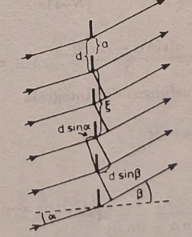

<!-- figure: cropped from source/p73.jpg -->
Incident rays (angle $\alpha$) and diffracted rays (angle $\beta$) at a line
grating: slit width $a$, slit spacing $d$; two rays whose source points are
$\xi$ apart differ in path by $\xi(\sin\alpha - \sin\beta)$, built from the
pieces $d\sin\alpha$ and $d\sin\beta$ shown.

Consider first a grating of **infinitely many** slits at spacing $d$,
illuminated at incidence angle $\alpha$. Collect all rays leaving
corresponding points of the slits (say, each slit's left edge) in a direction
$\beta$. In general their total intensity **vanishes**: to every such ray one
can find another, from a more distant slit, that is shifted by exactly
$180^\circ$ in phase, and the pairs annihilate. Only when the path difference
between *adjacent* rays, $d(\sin\alpha - \sin\beta)$, is a whole multiple of
the wavelength does this pairing fail — then all slits add up in step.
Intensity maxima of the infinite grating therefore occur at angles $\beta$
with

$$
d(\sin\alpha - \sin\beta) = m\lambda, \qquad m\in\mathbb{N}_0 \qquad (\mathrm{g}1)
$$

($m$ is called the **order** of the maximum). This argument ignores the
interference structure coming from superposing rays *within* one slit — that
structure overlays the diffraction picture, and the full calculation below
includes it.

### The finite grating: amplitude by superposition

Now the real case: slit width $a$, slit spacing $d$, slit count $N$. We
compute the amplitude in direction $\beta$ for incidence angle $\alpha$. When
two rays with phase difference $\eta$ superpose, the resulting amplitude is
proportional to the complex number $e^{i\eta}$ — so the task is to integrate
over all phase differences of rays within each slit and across the slits. Two
rays whose starting points on the grating are a distance $\xi$ apart differ in
phase by

$$
\eta = k\xi(\sin\alpha - \sin\beta) = 2\pi\ \frac{\xi(\sin\alpha - \sin\beta)}{\lambda} \qquad (\mathrm{g}2)
$$

Hence the amplitude $u$ is a sum of one integral per slit (slit $n$ spans
$\xi$ from $nd$ to $nd + a$):

$$
u \sim \int_0^a + \int_d^{d+a} + \cdots \int_{(N-1)d}^{(N-1)d+a} e^{i2\pi\frac{\xi(\sin\alpha - \sin\beta)}{\lambda}}\ d\xi \qquad (\mathrm{g}3)
$$

Abbreviate the two recurring phase blocks —
$\gamma$ for the *slit width*, $\delta$ for the *slit spacing*:

$$
\gamma \equiv \pi\ \frac{a(\sin\alpha - \sin\beta)}{\lambda}, \qquad \delta \equiv \pi\ \frac{d(\sin\alpha - \sin\beta)}{\lambda} \qquad (\mathrm{g}4)
$$

Each slit integral is elementary:

$$
\int_{nd}^{nd+a} e^{i\frac{2\pi}{\lambda}(\sin\alpha - \sin\beta)\xi}\ d\xi = \frac{-i\lambda}{2\pi(\sin\alpha - \sin\beta)}\left(e^{i\frac{2\pi}{\lambda}(\sin\alpha-\sin\beta)nd}\right)\left(e^{i\frac{2\pi}{\lambda}(\sin\alpha-\sin\beta)a} - 1\right) = \frac{-ia}{2\gamma}\ e^{2in\delta}\left(e^{2i\gamma} - 1\right)
$$

— the same factor $(e^{2i\gamma}-1)/\gamma$ for every slit, times a slit-index
phase $e^{2in\delta}$. Summing the geometric series over $n$:

$$
u \sim \frac{1}{\gamma}\left(e^{2i\gamma} - 1\right)\sum_{n=0}^{N-1} e^{2in\delta} = \frac{1}{\gamma}\left(e^{2i\gamma} - 1\right)\frac{1 - e^{2iN\delta}}{1 - e^{2i\delta}} \qquad (\mathrm{g}5)
$$

### The intensity formula

Taking the modulus squared (use $|e^{2i\varphi} - 1|^2 = 4\sin^2\varphi$ on
each factor):

$$
I \sim uu^\ast \sim 4\ \frac{\sin^2\gamma}{\gamma^2}\cdot\frac{\sin^2 N\delta}{\sin^2\delta} \qquad (\mathrm{g}6)
$$

Read it factor by factor:

- The **second factor** $\sin^2 N\delta/\sin^2\delta$ produces the **main
  maxima** at $\delta = m\pi$ (both sine functions vanish; the limit is
  $N^2$), i.e. at

$$
d(\sin\alpha - \sin\beta) = m\lambda, \qquad m\in\mathbb{N}_0 \qquad (\mathrm{g}7)
$$

  — recovering (g1). Between main maxima it oscillates fast, with **zeros**
  (dark spots) at $\delta = m'\pi/N$ ($m'\in\mathbb{N}$, $m'$ not a multiple
  of $N$) and weaker **side maxima** in between (from $\partial I/\partial\delta = 0$).
- The **first factor** $\sin^2\gamma/\gamma^2$ is the **single-slit
  envelope** — the interference structure of each individual slit — overlaid
  on the whole diffraction pattern (dashed curve in the figure).

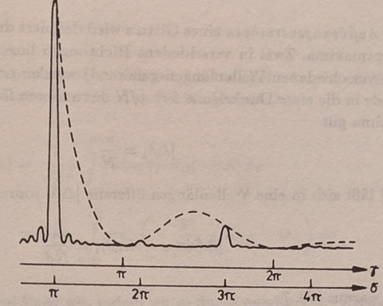

<!-- figure: cropped from source/p75.jpg -->
Intensity in the diffraction by a line grating with $N = 60$ slits and
$d/a = 7/4$, plotted against $\gamma$ (upper scale) and $\delta$ (lower
scale). Solid: full pattern with sharp main maxima at $\delta = m\pi$ and tiny
side maxima; dashed: the single-slit envelope $\sin^2\gamma/\gamma^2$.

**Division of labor.** The larger $N$, the sharper the main maxima — the
first dark zones sit only $\pi/N$ away from each peak. Altogether: $d$
determines the **positions** of the main maxima, $N$ their **sharpness**, and
$a$ the **intensity ratios** of the different orders. If, say, $d = 2a$
exactly, then at even orders $\gamma = m\pi/2$ makes $\sin^2\gamma = 0$ — the
even-order maxima are extinguished by the envelope. For gratings with more
complicated slit structure — transmission not a box function but e.g.
sinusoidal ("Sinusgitter") — the transmission function takes over the role of
$a$.

### Resolving power

The **resolving power** of a grating is defined by the separability of two
main maxima. Two maxima lying in different directions (e.g. belonging to two
different wavelengths) are still counted as separated when one falls exactly
into the **first dark zone** $\delta = \pi/N$ of the other — for the two
maxima this means

$$
|\Delta\delta| = \frac{\pi}{N} \qquad (\mathrm{g}8)
$$

(the Rayleigh criterion, in grating clothes). Convert $|\Delta\delta|$ into a
wavelength difference: from the definition (g4) of $\delta$,

$$
|\Delta(\sin\alpha - \sin\beta)| = \frac{\lambda}{Nd} \qquad (\mathrm{g}9)
$$

and from the maximum condition (g7), $d\ \Delta(\sin\alpha-\sin\beta) = m\ \Delta\lambda$,
so

$$
m|\Delta\lambda| = \frac{\lambda}{N}
$$

Thus the resolving power is

$$
\boxed{\frac{\lambda}{|\Delta\lambda|} = mN}
$$

**Resolution equals order times line count.** A grating resolves the more
finely, the more slits it has. Example: to separate the two neighboring
yellow **sodium vapor lines** ($\Delta\lambda = 6\ \text{Å}$ at
$\lambda = 5893\ \text{Å}$) needs $\lambda/\Delta\lambda \approx 1000$ — so
the first-order lines can be separated with a grating of $1000$ lines; if one
settles for the weaker second-order maxima, $500$ lines suffice.

> **Why this supplement earns its place here.** Equation (g6) is the same
> $\sin^2 N\delta/\sin^2\delta$ machinery that governs Bragg peaks from a
> crystal ($N$ lattice planes) in §3.6 — and the finite-$N$ peak width
> $\pi/N$ is exactly what limited the momentum measurement in §3.22. One
> classical formula, three appearances.

---

## 3.24 Exercise 3.10 — properties of a Gaussian wave packet
*(Eigenschaften eines Gaußschen Wellenpaketes)*

<!-- source: source/p76.jpg, source/p77.jpg, source/p78.jpg, source/p79.jpg -->

**Problem.** At time $t = 0$ a wave packet is described by

$$
\psi(x,0) = A\exp\left(-\frac{x^2}{2a^2} + ik_0x\right) \qquad (\mathrm{G}1)
$$

(the **Gaussian wave packet**: bell of width $\sim a$, carrier wavenumber
$k_0$).

- a) Represent $\psi(x,0)$ as a superposition of plane waves.
- b) How are the widths of the packet in position space and in $k$-space
  related?
- c) Using the dispersion relation for de Broglie waves, compute
  $\psi(x,t)$.
- d) Discuss $|\psi(x,t)|^2$.
- e) How must the constant $A$ be chosen, by the probability interpretation,
  for $\psi(x,t)$ to describe the motion of one particle?

This is *the* canonical wave-packet computation — the concrete workhorse
behind everything §§3.4, 3.17, 3.18 said abstractly.

### (a) The spectrum: Gaussian in, Gaussian out

The frequency spectrum of the packet is its Fourier transform:

$$
\alpha(k) = \frac{1}{\sqrt{2\pi}}\int_{-\infty}^{\infty}\psi(x,0)\exp(-ikx)\ dx = \frac{A}{\sqrt{2\pi}}\int_{-\infty}^{\infty}\exp\left(-\frac{x^2}{2a^2} + ik_0x - ikx\right)dx
$$

Solve the integral by **completing the square** in the exponent so that it
reduces to the complete error integral

$$
\int_{-\infty}^{\infty} e^{-\xi^2} d\xi = \sqrt{\pi}
$$

The quadratic completion reads

$$
-\frac{x^2}{2a^2} - i(k-k_0)x = -\left(\frac{x}{\sqrt{2}a} + \frac{ia(k-k_0)}{\sqrt{2}}\right)^2 - \frac{a^2(k-k_0)^2}{2}
$$

so

$$
\alpha(k) = \frac{A}{\sqrt{2\pi}}\int_{-\infty}^{\infty}\exp\left\lbrace-\left(\frac{x}{\sqrt{2}a} + \frac{ia(k-k_0)}{\sqrt{2}}\right)^2\right\rbrace\exp\left(-\frac{a^2(k-k_0)^2}{2}\right)dx
$$

Substituting the bracket by $-\xi^2$ (i.e. $\xi$ = the bracketed quantity,
$dx = \sqrt{2}\ a\ d\xi$) leaves the error integral:

$$
\alpha(k) = \frac{A}{\sqrt{2\pi}}\ \sqrt{2}\ a\ \exp\left(-\frac{a^2(k-k_0)^2}{2}\right)\sqrt{\pi} = A\ a\ \exp\left(-\frac{a^2(k-k_0)^2}{2}\right)
$$

The coefficients $\alpha(k)$ give the share of the partial wave of wavenumber
$k$ in the Gaussian packet; as a superposition of plane waves the packet is

$$
\psi(x,0) = \frac{1}{\sqrt{2\pi}}\int_{-\infty}^{\infty}\alpha(k)\ e^{ikx}\ dk \qquad (\mathrm{G}2)
$$

**A Gaussian's Fourier transform is again a Gaussian**, centered at the
carrier $k_0$ — no side lobes, unlike the sharp-edged band of §3.4 whose
transform rang with $\sin z/z$ oscillations.

### (b) Widths: the uncertainty product

From (G1), the width of the position Gaussian is $\Delta x \approx a$. The
plane-wave distribution in (G2) is governed by
$\exp(-(k-k_0)^2a^2/2)$, whose width is $\Delta k \approx 1/a$. Hence

$$
\Delta x\cdot\Delta k \sim 1
$$

— the uncertainty relation between the two widths, with the constant of order
one because the widths were read off loosely.

> **Sharpened: the Gaussian is the minimum packet.** With honest rms widths
> the position Gaussian $e^{-x^2/a^2}$ (density!) has
> $\Delta x = a/\sqrt{2}$, and the momentum density
> $\propto e^{-a^2(k-k_0)^2}$ has $\Delta k = 1/(a\sqrt{2})$, so
> $\Delta x\ \Delta k = 1/2$ exactly, i.e. $\Delta x\ \Delta p = \hbar/2$:
> the Gaussian **saturates** the exact bound of §3.18 — as the equality
> analysis there predicted (the state killing $I(\alpha)$ is a Gaussian).

### (c) Switching on time

A general wavefunction built from these plane waves evolves as

$$
\psi(x,t) = \frac{1}{\sqrt{2\pi}}\int_{-\infty}^{\infty}\alpha(k)\ e^{i(kx - \omega t)}\ dk
$$

with the de Broglie dispersion relation (§3.2, dropping the rest-energy
constant)

$$
\omega(k) = \frac{\hbar k^2}{2m}
$$

Inserting $\alpha(k)$ from part (a):

$$
\psi(x,t) = \frac{A\ a}{\sqrt{2\pi}}\int_{-\infty}^{\infty}\exp\left(-\frac{a^2(k-k_0)^2}{2} + ikx - i\frac{\hbar k^2}{2m}t\right)dk
$$

The exponent is again quadratic in $k$ — same drill: complete the square,
error integral. The result for the time-dependent wavefunction:

$$
\psi(x,t) = \frac{A}{\sqrt{1 + i(\hbar t/ma^2)}}\ \exp\left(-\frac{x^2 - 2ia^2k_0x + i(a^2\hbar k_0^2/m)t}{2a^2(1 + i(\hbar t/ma^2))}\right)
$$

Note the single dimensionless combination doing all the work:
$\hbar t/ma^2$ — time measured in units of the packet's natural spreading
time $\tau = ma^2/\hbar$.

### (d) The moving, spreading density

Taking the modulus squared (multiply by the conjugate; the algebra rationalizes
the complex denominator):

$$
|\psi(x,t)|^2 = \frac{|A|^2}{\sqrt{1 + (\hbar t/ma^2)^2}}\ \exp\left(-\frac{\left(x - (\hbar k_0/m)t\right)^2}{a^2(1 + (\hbar t/ma^2)^2)}\right)
$$

Everything §§3.3–3.4 promised is on display in one formula:

- **It moves at the group velocity.** The Gaussian has its maximum at
  $x = \hbar k_0 t/m$; the maximum travels with
  $v = \hbar k_0/m = p_0/m$ — the classical particle velocity.
- **It spreads** (*zerfließt*). At $t = 0$ the width of $|\psi|^2$ is just
  $a$; at a later time (and, purely formally, also at an earlier one — the
  formula is symmetric in $t \to -t$) it is

$$
a' = a\sqrt{1 + (\hbar t/ma^2)^2}
$$

- **The norm is conserved**: the prefactor shrinks exactly as the width grows,
  keeping the total area constant — reassuring, given (12).

> **How fast is "spreading"?** The clock is $\tau = ma^2/\hbar$. For an
> electron localized to an ångström:
> $\tau \approx (9\times 10^{-31}\ \text{kg})(10^{-10}\ \text{m})^2/10^{-34}\ \text{J s} \approx 10^{-16}\ \text{s}$
> — atomic packets disperse essentially instantly, which is why picturing a
> bound electron as a compact lump orbiting the nucleus fails so badly. For a
> dust grain ($10^{-9}$ kg, localized to a micron) $\tau \sim 10^{13}$ s —
> centuries. The classical world owes its solidity to big $m$ in
> $\tau = ma^2/\hbar$.

### (e) Fixing $A$: normalization

For one particle the normalization condition must hold at all times:

$$
1 = \int_{-\infty}^{\infty}|\psi(x,t)|^2\ dx = |A|^2\ a\int_{-\infty}^{\infty}\exp(-\xi^2)\ d\xi = |A|^2\ a\sqrt{\pi}
$$

(substituting the Gaussian to the error integral; note the width factors
conspire so the answer is time-independent, as promised by §3.9). Hence

$$
A = \frac{1}{\sqrt{a\sqrt{\pi}}}
$$

Since the condition constrains only the **magnitude** of $A$, the phase of
the wave remains undetermined — the $e^{i\alpha}$ ambiguity of §3.9, met now
in the flesh.

---

## 3.25 Exercise 3.11 — normalizing the hydrogen 1s and 2s wavefunctions
*(Normierung von Wellenfunktionen)*

<!-- source: source/p79.jpg, source/p80.jpg, source/p81.jpg -->

**Problem.** The unnormalized wavefunctions for the $1s$ and $2s$ electron in
the hydrogen atom are (they will be *derived* in Chapter 9)

$$
\psi_{1s}(r,\vartheta,\varphi) = \psi_{1s}(r) = e^{-\varrho}, \qquad \psi_{2s}(r,\vartheta,\varphi) = \psi_{2s}(r) = \left(1 - \frac{\varrho}{2}\right)e^{-\varrho/2}
$$

with $\varrho = r/a$ and the Bohr radius $a = \hbar^2/me^2$.

- a) Show that they are orthogonal, and normalize them.
- b) Sketch $|\psi|^2$ and $4\pi r^2|\psi|^2$ for both cases. What do
  $|\psi|^2$ and $4\pi r^2|\psi|^2$ mean?

### (a) Three integrals

The normalization conditions for the normalized functions
$\tilde\psi_{1s}$, $\tilde\psi_{2s}$ (differing from $\psi_{1s}$, $\psi_{2s}$
only by constant factors) read

$$
\int|\tilde\psi_{1s}|^2\ d^3r = \int|\tilde\psi_{2s}|^2\ d^3r = 1
$$

and additionally the orthogonality

$$
\int\psi_{1s}^\ast\psi_{2s}\ d^3r = 0
$$

is to be checked. All three integrals are done in spherical coordinates
(the wavefunctions are angle-independent, so the angles just give $4\pi$)
with the master formula

$$
\int_0^\infty x^{\nu - 1}e^{-\mu x}\ dx = \frac{(\nu - 1)!}{\mu^\nu}, \qquad \nu\in\mathbb{N}_0
$$

**Norm of 1s** ($\mu = 2/a$, $\nu = 3$):

$$
\int|\psi_{1s}|^2\ d^3r = 4\pi\int_0^\infty r^2\ e^{-\frac{2}{a}r}\ dr = 4\pi\left(\frac{a}{2}\right)^3 2! = \pi a^3
$$

**Norm of 2s** — expand the square and take the three moments
($\mu = 1/a$; $\nu = 3, 4, 5$):

$$
\int|\psi_{2s}|^2\ d^3r = 4\pi\int_0^\infty r^2\left(1 - \frac{r}{2a}\right)^2 e^{-r/a}\ dr = 4\pi\int_0^\infty e^{-r/a}\left(r^2 - \frac{r^3}{a} + \frac{r^4}{4a^2}\right)dr
$$

$$
= 4\pi\left(2!\ a^3 - \frac{1}{a}a^4\ 3! + \frac{1}{4a^2}a^5\ 4!\right) = 4\pi a^3\left(2 - 6 + 6\right) = 8\pi a^3
$$

**Orthogonality** — the mixed integral has decay constant $\mu = 3/(2a)$
(from $e^{-\varrho}e^{-\varrho/2}$):

$$
\int\psi_{1s}^\ast\psi_{2s}\ d^3r = 4\pi\int_0^\infty r^2\left(1 - \frac{r}{2a}\right)e^{-\frac{3}{2a}r}\ dr = 4\pi\left(\left(\frac{2a}{3}\right)^3 2! - \frac{1}{2a}\left(\frac{2a}{3}\right)^4 3!\right) = 0
$$

— the two terms cancel exactly: pulling out $(2a/3)^3$, the bracket is
$2 - (3!/2a)(2a/3) = 2 - 2 = 0$. The normalized wavefunctions are therefore

$$
\tilde\psi_{1s} = \frac{1}{\sqrt{\pi a^3}}\ \psi_{1s} \qquad \text{and} \qquad \tilde\psi_{2s} = \frac{1}{\sqrt{8\pi a^3}}\ \psi_{2s}
$$

(the $1s$ result agrees with the wavefunction used in Exercise 3.3).

> **The cancellation is not luck.** $1s$ and $2s$ will turn out to be
> eigenfunctions of the same Hamiltonian with *different* energies, and such
> eigenfunctions are automatically orthogonal (shown in Chapter 4). The
> mechanism here is visible to the naked eye: $\psi_{2s}$ changes sign at its
> **node** $\varrho = 2$ ($r = 2a$), and the positive inner region against
> the negative outer tail balance perfectly in the overlap with the
> node-free $\psi_{1s}$.

### (b) Point density versus radial density

The probability of finding the electron with (normalized) wavefunction $\psi$
in the volume element $dV$ at position $\vec r$ is simply
$|\psi(\vec r)|^2 dV$ — that is the meaning of $|\psi|^2$: the **probability
density at a point**. The normalization $\int|\psi|^2 dV = 1$ expresses that
the electron is found *somewhere* with certainty.

The probability of finding the electron in a **spherical shell** of radius
$r$ and thickness $dr$ is

$$
\int_{\mathrm{shell}} |\psi|^2\ dV = 4\pi r^2\ |\psi(r)|^2\ dr
$$

valid when the wavefunction is independent of the angles $\vartheta,\varphi$,
as here. That is the meaning of the second expression: $4\pi r^2|\psi|^2$ is
the **radial probability density** — likelihood per unit radius, all
directions pooled.

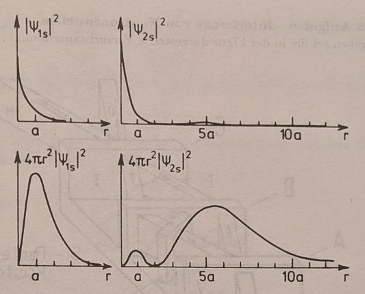

<!-- figure: cropped from source/p81.jpg -->
Probability density (top row) and probability density in a spherical shell
(bottom row) for the two hydrogen wavefunctions. Left column 1s, right column
2s; note the 2s node and the different radial scales (up to $10a$).

Reading the four panels:

- $|\psi_{1s}|^2$ is **maximal at the nucleus** ($r = 0$) and falls
  monotonically. Yet the radial density $4\pi r^2|\psi_{1s}|^2$ vanishes at
  $r = 0$ (no volume there!), rises to a peak, and falls again. The peak sits
  at exactly $r = a$: from
  $\frac{d}{dr}\left(r^2 e^{-2r/a}\right) = 0$ follows $2r - 2r^2/a = 0$,
  i.e. $r = a$. **The most probable radius of the ground state is the Bohr
  radius** — Bohr's orbit survives as the mode of a distribution.
- $|\psi_{2s}|^2$ starts high at the nucleus, dies at the **node** $r = 2a$,
  and has a small revival beyond. Its radial density shows a modest inner
  bump, the zero at $r = 2a$, and a broad dominant bump around $r \approx 5a$
  — the $2s$ electron lives, on average, much farther out, as befits the
  second shell.

> **Why this matters.** The pair of pictures kills a common confusion: "where
> is the density largest" (at the nucleus, for s-states) and "at what radius
> is the electron most likely found" (at $a$ for 1s) are *different
> questions*, related by the $4\pi r^2$ volume factor. Chemistry's shell
> pictures plot the radial density; scattering experiments probe $|\psi|^2$.

---

## 3.26 Exercise 3.12 — a melon in quantum land
*(Melone im Quantenland)*

<!-- source: source/p81.jpg -->

**Problem.** In strange quantum land, where $\hbar = 10^4\ \text{erg s}$,
there are melons with very hard shells, a diameter of about $20\ \text{cm}$,
and seeds of about $0.1\ \text{g}$ mass. Why must one be careful when cutting
open a quantum-land melon? Can a person *see* the melon? (How large is the
melon's recoil upon reflecting one "visible" photon of wavelength
$628\ \text{nm}$?)

**Why cutting is dangerous.** Inside the shell each seed is localized to
$\Delta x \approx 10\ \text{cm}$, so by the uncertainty relation
$\Delta p\cdot\Delta x \approx \hbar$ its momentum is spread by

$$
\Delta p \approx \frac{10^4\ \text{erg s}}{10\ \text{cm}} = 10^3\ \text{g cm/s} \qquad\Longrightarrow\qquad \Delta v = \frac{\Delta p}{m} = \frac{10^3}{0.1}\ \text{cm/s} = 100\ \text{m/s}
$$

With this (average) speed the seeds leave the melon when it is cut open —
confinement alone arms them, and opening the box releases them at
bullet-like speed.

**Can you see it?** A photon of wavelength $\lambda = 628\ \text{nm} =
6.28\times 10^{-5}\ \text{cm}$ carries momentum and energy

$$
p = \hbar\ \frac{2\pi}{\lambda} = 10^4\cdot 10^5 = 10^9\ \text{g cm/s}, \qquad E = c\ p = 3\times 10^{19}\ \text{erg}
$$

The melon has mass $m \approx \frac{4\pi}{3}R^3\cdot 1\ \text{g/cm}^3
\approx 4\ \text{kg}$ and rest energy $mc^2 \approx 3.6\times 10^{24}\ \text{erg}$,
comfortably above $E$ — so we may compute non-relativistically. Let the
reflection be elastic; then approximately the melon's momentum after the kick
is

$$
p_M = 2p = 2\times 10^9\ \text{g cm/s} \qquad\Longrightarrow\qquad V_M = \frac{p_M}{m} = 5\ \text{km/s}
$$

less than the escape velocity of the Earth — the melon at least stays on the
planet. (Printing note: the book displays the exponent as
$2\cdot 10^{19}$; the printed $V_M = 5\ \text{km/s}$ confirms the correct
value $2\cdot 10^9\ \text{g cm/s}$.) But "seeing" has failed twice over: by
the time you register the reflected photon, the melon has long since been
kicked elsewhere ($\Delta p_M\cdot\Delta x_M \approx \hbar$ applies to the
melon too!). And absorbing photons of $3\times 10^{19}\ \text{erg}$ — that is
$3\times 10^{12}\ \text{J}$ per photon — "would probably cause a person some
discomfort," as Greiner dryly puts it.

> **The point of the joke.** Every "paradox" of quantum mechanics is a
> statement about the *size of $\hbar$* relative to us. Scale
> $\hbar$ from $10^{-27}$ up to $10^4\ \text{erg s}$ and localization becomes
> ballistic, observation becomes artillery, and daily life becomes
> impossible. Conversely: the reason melons behave classically in our world
> is *only* that $\hbar$ is twenty-seven orders of magnitude smaller than
> everyday actions — quantum mechanics never switches off, it just becomes
> invisibly gentle.

---

## 3.27 Exercise 3.13 — interference of neutron waves
*(Interferenz von Neutronenwellen)*

<!-- source: source/p82.jpg, source/p83.jpg -->

The chapter closes with the modern, laboratory-grade version of everything it
has claimed: a **neutron interferometer** (after H. Rauch, *Contemp. Phys.*
**27**, No. 4, 345–360 (1986)).

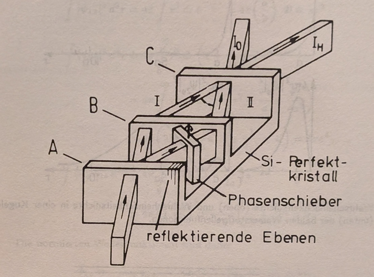

<!-- figure: cropped from source/p82.jpg -->
Structure of the neutron interferometer: three plates A, B, C cut from one
Si perfect crystal ("Si-Perfektkristall"); the reflecting lattice planes
("reflektierende Ebenen") are indicated, the phase shifter ("Phasenschieber")
sits in one arm; behind plate C the intensities of the forward beam and the
deflected beam are measured.

**The setup.** A beam of thermal neutrons ($\lambda \cong 1.8\ \text{Å}$)
strikes crystal plate A of the interferometer, which consists of a **silicon
perfect crystal** (all three plates are carved from one single crystal, so
the lattice planes of A, B, C stay aligned to within ångströms across
centimeters). Partial beam I keeps the direction of the incoming beam;
partial beam II is **coherently Bragg-scattered** at the lattice planes
indicated in the figure. Beam I is then scattered at plate B toward C; beam
II first traverses a **phase shifter** — a slab of material characterized,
for neutrons, by the refractive index

$$
n \cong 1 - \lambda^2\ \frac{N b_c}{2\pi} \qquad (\mathrm{n}1)
$$

where $\lambda$ is the neutron wavelength, $b_c$ the **coherent scattering
length**, and $N$ the particle density of the sample — after which beam II is
also deflected over B onto C. After passing C the two partial beams can
interfere; behind plate C one measures the intensities of the transmitted and
deflected beams, $I_0$ and $I_H$. **Task:** compute $I_0$ as a function of
the thickness $D$ of the phase shifter, given
$I_0 \sim |\psi_0^{\mathrm{I}} + \psi_0^{\mathrm{II}}|^2$ and, on symmetry
grounds, $|\psi_0^{\mathrm{I}}| = |\psi_0^{\mathrm{II}}|$.

**Solution.** The phase a neutron wave accumulates crossing a distance $D$ in
vacuum is

$$
\varphi = kD, \qquad k = \frac{2\pi}{\lambda} \qquad (\mathrm{n}2)
$$

Crossing the same distance inside a dispersive medium of refractive index
$n$, the wavenumber is $k' = 2\pi/\lambda' = kn$, so

$$
\varphi' = k'D = k n D
$$

The phase shift of partial beam II relative to I is therefore

$$
\chi = \varphi' - \varphi = kD(1 - n)
$$

(magnitude; note $n < 1$ for neutrons in most materials, so the wave in the
medium is *advanced* — an amusing contrast to glass and light). Insert the
refractive index (n1):

$$
\chi = kD\ \lambda^2\frac{Nb_c}{2\pi} = N b_c\lambda D
$$

— the $k = 2\pi/\lambda$ eats one factor of $\lambda$ and the $2\pi$. So the
two amplitudes at the exit differ only by this phase:

$$
\psi_0^{\mathrm{II}} = \psi_0^{\mathrm{I}}\ e^{-iNb_c\lambda D}
$$

and the transmitted intensity oscillates in the slab thickness $D$:

$$
I_0 \sim |\psi_0^{\mathrm{I}} + \psi_0^{\mathrm{II}}|^2 \sim (1 + \cos Nb_c\lambda D)
$$

(the two-beam interference formula: $|1 + e^{-i\chi}|^2 = 2(1+\cos\chi)$).

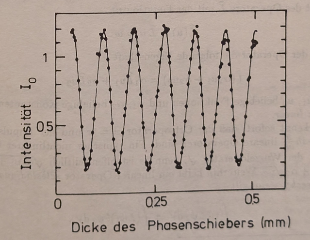

<!-- figure: cropped from source/p83.jpg -->
Experimental result of a neutron interferometer measurement: the intensity
$I_0$ oscillates as a function of the phase-shifter thickness (in mm),
following the predicted $1 + \cos Nb_c\lambda D$ with only small deviations.

The measured curve shows exactly these oscillations, with only small
deviations from the computed one.

> **Why this experiment is a fitting finale.** Every thread of the chapter
> runs through it. The neutron's de Broglie wave (§3.1) is Bragg-split by a
> crystal (§3.6) into two *macroscopically separated* paths (centimeters
> apart!), picks up a computable relative phase from a slab whose neutron
> refractive index $n - 1 \sim -\lambda^2 Nb_c/2\pi$ is of order $10^{-6}$,
> and recombines into a cosine that converts that million-times-diluted phase
> into a full-swing intensity modulation. And the statistics are Born's
> (§3.9): the beam is so dilute that typically **one neutron at a time** is
> in the apparatus — each neutron interferes *with itself*, and the cosine
> emerges event by event in the counters. The same instrument later measured
> the gravitational phase shift of the neutron wave (the COW experiment) and
> the famous $4\pi$ sign change of spinor rotation — matter-wave
> interferometry as a precision tool, seventy years after de Broglie's
> guess.

---

## Chapter summary

| Result | Expression | Meaning |
|---|---|---|
| de Broglie relations | $E = \hbar\omega$, $\vec p = \hbar\vec k$ | wave–particle dictionary |
| Matter plane wave | $\psi = A e^{(i/\hbar)(\vec p\cdot\vec r - Et)}$ | free-particle wavefunction |
| de Broglie wavelength | $\lambda = h/p = h/\sqrt{2m_0E}$ | sets the scale of wave effects |
| Dispersion (vacuum) | $\omega(k) = m_0c^2/\hbar + \hbar k^2/2m_0 + \cdots$ | matter waves disperse in empty space |
| Phase velocity | $u = \omega/k = c^2/v > c$ | crests of the ideal wave; carries nothing |
| Group velocity | $v_g = d\omega/dk = dE/dp = v$ | speed of the packet; equals particle speed |
| Wave packet | $\psi = C(x,t) e^{i(k_0x - \omega_0 t)}$, $C \propto \sin z/z$ | localized particle; spreads since $d^2\omega/dk^2\neq 0$ |
| Plane grating, surface | $n\lambda = d\sin\theta$ | Davisson–Germer |
| Bragg reflection | $2d\sin\theta = n\lambda$ | Debye–Scherrer powder; rings $Dd = 2nL\lambda$ |
| Born rule, position | $w = dW/dV = \psi\psi^\ast$ | probability density; Eq. 11 |
| Normalization | $\int\psi\psi^\ast dV = 1$ | particle is somewhere; needs square-integrable $\psi$; Eq. 12 |
| Box normalization | $\psi_{\vec k} = e^{i(\vec k\cdot\vec r - \omega t)}/\sqrt{V}$; $\vec k = 2\pi\vec n/L$ | momentum quantized on a lattice; Eqs. 16, 17 |
| Orthonormality | $\int\psi_{\vec k}^\ast\psi_{\vec k'}dV = \delta_{\vec k\vec k'}$ | plane waves are an orthonormal basis; Eq. 19 |
| Expansion | $\psi = \sum a_{\vec k}\psi_{\vec k}$; $a_{\vec k} = \int\psi\psi_{\vec k}^\ast dV$ | spectral decomposition; Eqs. 21, 22 |
| Born rule, momentum | $\sum \lvert a_{\vec k}\rvert^2 = 1$; probability of $\vec p = \hbar\vec k$ is $\lvert a_{\vec k}\rvert^2$ | Eq. 23 |
| Momentum operator | $\langle\vec p\rangle = \int\psi^\ast(-i\hbar\vec\nabla)\psi\ dV$ | derived, not postulated; Eq. 29 |
| Operator dictionary | $\hat T = -\hbar^2\Delta/2m$; $\hat{\vec L} = -i\hbar\vec r\times\vec\nabla$; $\hat H = \hat T + \hat V$ | observables become operators |
| Hydrogen check | $\langle\hat T\rangle = me^4/2\hbar^2$; $\langle\hat V\rangle = -me^4/\hbar^2$ | total $-me^4/2\hbar^2$ matches Bohr; Exercise 3.3 |
| Superposition | $\psi = \sum a_n\psi_n$ or $\psi = \int c_f\varphi_f df$ | interference cross terms; wave equation must be linear; Eqs. 30, 31 |
| Momentum-space density | $w(\vec p,t) = \lvert c(\vec p,t)\rvert^2$; $\psi_{\vec p}$ delta-normalized | continuum version of the $a_{\vec k}$ story; Example 3.4 |
| Uncertainty, heuristic | $\Delta k\ \Delta x = \pi$ hence $\Delta x\ \Delta p = h/2$ | packet width times band width is bounded below |
| Uncertainty, exact | rms spreads obey $\Delta x\ \Delta p \geq \hbar/2$ | discriminant proof; equality only for Gaussians |
| Measurement examples | slit $\Delta y\Delta p_y = h$; microscope $\Delta x\Delta p_x \approx h$; grating $\Delta p\Delta s > h$ | every apparatus pays the same bill |
| Grating resolution | intensity $4\sin^2\gamma/\gamma^2\cdot\sin^2 N\delta/\sin^2\delta$; power $\lambda/\Delta\lambda = mN$ | order times line count; Supplement 3.9 |
| Gaussian packet | $\alpha(k) = Aa\ e^{-a^2(k-k_0)^2/2}$; width $a' = a\sqrt{1 + (\hbar t/ma^2)^2}$ | moves at $\hbar k_0/m$; spreads on timescale $ma^2/\hbar$; minimum-uncertainty state |
| Hydrogen 1s/2s | norms $\pi a^3$, $8\pi a^3$; overlap $0$ | radial density $4\pi r^2\lvert\psi\rvert^2$ peaks at $r = a$ for 1s |
| Neutron interferometry | index $n \cong 1 - \lambda^2 Nb_c/2\pi$; $I_0 \sim 1 + \cos Nb_c\lambda D$ | single neutrons interfere with themselves; Exercise 3.13 |

**The lesson.** De Broglie's postulate $\lambda = h/p$ promotes the wave–particle
duality from a property of light to a property of *all* matter. The matter wave is
genuinely dispersive even in vacuum, which forces a careful split between phase
velocity (superluminal, physically inert) and group velocity (equal to the
particle's velocity, carrying the energy). The localized particle is a wave
packet that moves at $v_g = v$ but inexorably spreads — the first quantitative
sign that a particle's position is not a sharp, permanent thing. Electron
diffraction off crystals turned all of this from hypothesis into measured fact.

**The lesson, continued (pp. 47–66).** Born's statistical interpretation fixes
what the wave *is*: $|\psi|^2$ is a probability density, so $\psi$ must be
normalized, which the plane wave resists until space is boxed. The boxed plane
waves form an orthonormal, complete basis; expanding an arbitrary state in them
hands us a second Born rule — $|a_{\vec k}|^2$ is the *momentum* probability —
and the state space reveals itself as a Hilbert space. Computing the mean
momentum from that distribution and shuffling one integration by parts produces
the central object of the formalism: momentum acts on wavefunctions as the
operator $-i\hbar\vec\nabla$, and with it come $\hat T$, $\hat{\vec L}$, and the
Hamiltonian $\hat H$. The superposition principle forces the coming wave
equation to be linear, and the Fourier link between the position and momentum
densities already contains, in embryo, the Heisenberg uncertainty relation
$\Delta x\ \Delta p \sim h$.

**The lesson, concluded (pp. 67–83).** The uncertainty relation graduates from
estimate to theorem: for any normalizable state, an elementary discriminant
argument on the integral $I(\alpha) = \int|\alpha x\psi + \psi'|^2 dx \geq 0$
forces the rms spreads to obey $\Delta x\ \Delta p \geq \hbar/2$, with equality
reserved for Gaussians. The measurement gallery — slit, box, microscope,
grating — shows the bound is not an apparatus defect: each concrete attempt to
beat it is stopped by ordinary wave physics plus $p = h/\lambda$, and even the
cleverest scheme (scatter a monochromatic wave off the particle) fails because
sharp frequency means no localization. The Gaussian packet makes everything
concrete: Gaussian spectrum, motion at the group velocity, spreading on the
timescale $ma^2/\hbar$, minimum uncertainty. The hydrogen exercise turns the
Born rule into pictures — point density versus radial density, with the Bohr
radius reborn as the most probable radius — and the quantum-land melon shows
that the classical world is nothing but the smallness of $\hbar$. The finale
is experimental: a silicon-crystal neutron interferometer splits single
neutrons onto centimeter-separated paths and reads out their self-interference
as $I_0 \sim 1 + \cos Nb_c\lambda D$ — matter waves, statistics, and
superposition, all measured on one bench. The chapter's toolkit is complete;
what is still missing is the *equation of motion* for $\psi$ — the Schrödinger
equation, which the coming chapters build.
